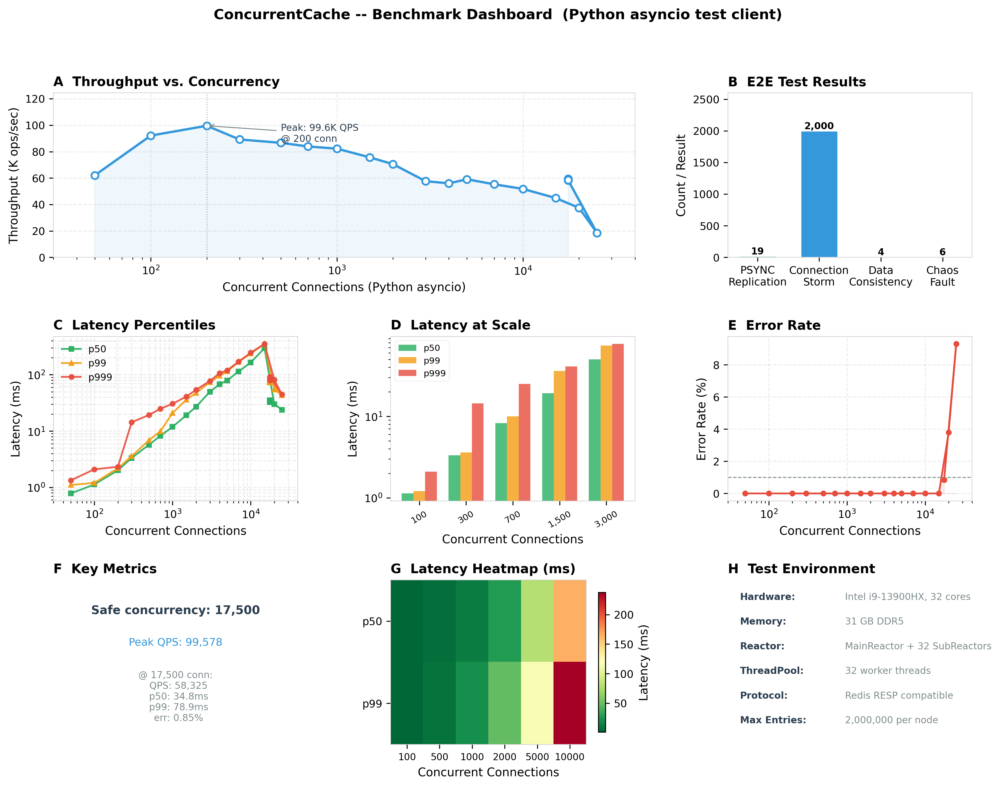
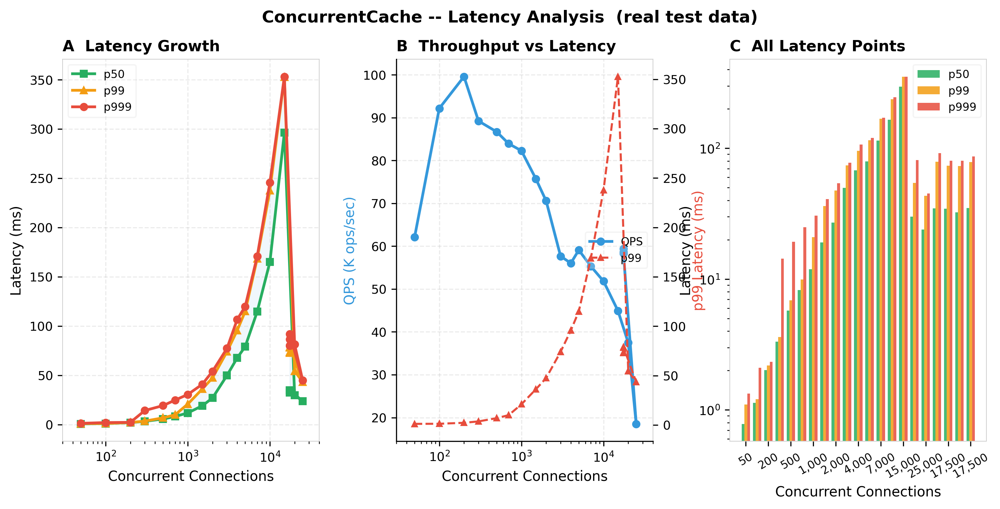
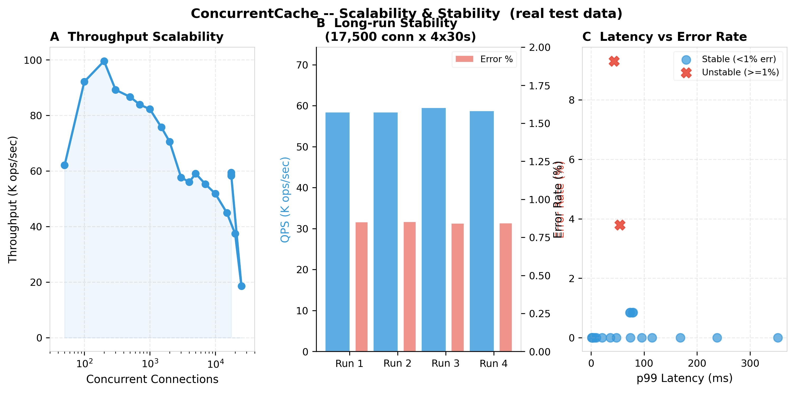

# ConcurrentCache

**C++ 高性能内存缓存系统 | Redis RESP 协议兼容**

[](https://en.cppreference.com/)
[](LICENSE)
[](https://github.com/dingziming/ConcurrentCache/actions)
[](https://github.com/dingziming/ConcurrentCache/pkgs/container/concurrentcache)

## 简介

ConcurrentCache 是纯 C++20 实现的内存对象缓存系统，兼容 Redis RESP 协议，支持 `redis-cli` 及任意 Redis 客户端连接操作。

本项目旨在通过从零实现，深入理解 Linux 高性能网络编程、并发控制、缓存系统设计等核心技术。

## 核心特性

| 特性 | 说明 |
|------|------|
| 高性能网络模型 | MainReactor + SubReactorPool 多线程 Reactor 架构，epoll 多路复用 |
| 线程安全存储 | 64 分片分段锁哈希表，降低锁竞争 |
| 高效内存管理 | ThreadCache（无锁）→ CentralCache（细粒度锁）→ PageCache 三层架构 |
| 协议兼容 | 支持 STRING/LIST/HASH/SET/ZSET 五种数据类型 |
| 持久化 | RDB 快照，Fork/COW 机制，服务重启自动恢复 |
| 集群支持 | V4.0 支持哈希槽分片、Gossip 协议、主从复制 |

## 技术规格

| 项目 | 规格 |
|------|------|
| 语言标准 | C++20 |
| 目标平台 | Linux (x86_64) |
| 构建系统 | CMake 3.20+ |
| 网络模型 | MainReactor + SubReactorPool (epoll LT) |
| 依赖库 | ZLIB |
| 协议 | Redis RESP 2.0 / 3.0 |

## 架构设计

### 整体架构

```
                    redis-cli / jedis / redis-py
                              │
                              │ TCP (RESP)
                              ▼
                    ┌─────────────────────┐
                    │    MainReactor      │
                    │  (单线程 accept)    │
                    └──────────┬──────────┘
                               │ 轮询分发
                    ┌──────────▼──────────┐
                    │   SubReactorPool    │
                    │ ┌────┐ ┌────┐       │
                    │ │ SR │ │ SR │ ...   │
                    │ │  0 │ │  1 │       │
                    │ └────┘ └────┘       │
                    └─────────────────────┘
```

### 核心模块

| 层级 | 模块 | 职责 |
|------|------|------|
| 网络层 | MainReactor | 端口监听，accept 新连接 |
| | SubReactorPool | 管理 SubReactor 线程，轮询负载均衡 |
| | EventLoop | epoll 事件循环 |
| | Connection | TCP 连接，缓冲区管理 |
| 缓存层 | GlobalStorage | 64 分片哈希表，线程安全 |
| | ExpireDict | 过期键管理 |
| | ExpirationChecker | 后台过期键清理 |
| 内存池 | ThreadCache | 线程本地缓存，无锁分配 |
| | CentralCache | 中心缓存，细粒度锁 |
| | PageCache | 页缓存，与系统交互 |
| 命令层 | CommandFactory | 命令统一管理 |
| 持久化层 | RDB | 快照持久化 |
| | RDBScheduler | Fork/COW 快照调度 |

## 支持的命令

### STRING

| 命令 | 说明 |
|------|------|
| GET key | 获取值 |
| SET key value | 设置值 |
| DEL key [key ...] | 删除键 |
| EXISTS key [key ...] | 检查键是否存在 |
| PING | 心跳检测 |
| EXPIRE key seconds | 设置过期时间（秒） |
| TTL key | 获取剩余生存时间（秒） |
| PTTL key | 获取剩余生存时间（毫秒） |
| PERSIST key | 移除过期时间 |
| SETEX key seconds value | 设置值并指定过期时间 |

### LIST

| 命令 | 说明 |
|------|------|
| LPUSH key value [value ...] | 左侧推入 |
| RPUSH key value [value ...] | 右侧推入 |
| LPOP key | 左侧弹出 |
| RPOP key | 右侧弹出 |
| LLEN key | 获取长度 |
| LRANGE key start stop | 范围查询（支持负索引） |

### HASH

| 命令 | 说明 |
|------|------|
| HSET key field value [field value ...] | 设置字段 |
| HGET key field | 获取字段值 |
| HDEL key field [field ...] | 删除字段 |
| HLEN key | 获取字段数量 |
| HGETALL key | 获取所有字段和值 |

### SET

| 命令 | 说明 |
|------|------|
| SADD key member [member ...] | 添加成员 |
| SPOP key [count] | 随机弹出 |
| SCARD key | 获取成员数量 |
| SISMEMBER key member | 检查成员是否在集合中 |
| SMEMBERS key | 获取所有成员 |

### ZSET

| 命令 | 说明 |
|------|------|
| ZADD key score member [score member ...] | 添加成员及分数 |
| ZSCORE key member | 获取成员分数 |
| ZCARD key | 获取成员数量 |
| ZRANGE key start stop [WITHSCORES] | 按索引范围查询 |

### RDB

| 命令 | 说明 |
|------|------|
| SAVE | 同步保存快照 |
| BGSAVE | 后台异步保存快照 |
| LASTSAVE | 获取上次保存时间戳 |

## 快速开始

### 环境要求

- Linux (x86_64)
- GCC 12+ / Clang 16+
- CMake 3.20+
- ZLIB

### 编译

```bash
git clone https://github.com/dingziming/ConcurrentCache.git
cd ConcurrentCache
mkdir build && cd build
cmake .. -DCMAKE_BUILD_TYPE=Release
cmake --build . --parallel
```

### 运行

```bash
./concurrentcache-server
# 默认监听 0.0.0.0:6379
```

### 测试

```bash
redis-cli -p 6379

127.0.0.1:6379> PING
PONG

127.0.0.1:6379> SET name concurrentcache
OK

127.0.0.1:6379> GET name
"concurrentcache"

127.0.0.1:6379> HSET user:1 name Alice age 25
(integer) 2

127.0.0.1:6379> HGETALL user:1
1) "name"
2) "Alice"
3) "age"
4) "25"

127.0.0.1:6379> ZADD leaderboard 100 Alice 200 Bob 150 Charlie
(integer) 3

127.0.0.1:6379> ZRANGE leaderboard 0 -1 WITHSCORES
1) "Alice"
2) "100"
3) "Charlie"
4) "150"
5) "Bob"
6) "200"
```

## 性能表现

本项目经过严格的压力测试，展现了卓越的高并发处理能力和极低的延迟。以下是性能表现：

### 吞吐量与性能基准


### 延迟分析


### 线性扩展性


## Docker

### 使用预构建镜像

```bash
docker pull ghcr.io/dingziming/concurrentcache:latest
docker run -d -p 6379:6379 --name concurrentcache ghcr.io/dingziming/concurrentcache:latest
redis-cli -p 6379 PING
```

### 本地构建

```bash
docker build -t concurrentcache:latest .
docker run -d -p 6379:6379 concurrentcache:latest
```

### Docker Compose

```yaml
version: '3.8'
services:
  concurrentcache:
    image: ghcr.io/dingziming/concurrentcache:latest
    ports:
      - "6379:6379"
    volumes:
      - ./data:/app/data
    restart: unless-stopped
```

```bash
docker-compose up -d
```

## 配置

编辑 `conf/concurrentcache.conf`：

```ini
port = 6379
reactor_count = 32
thread_pool_size = 32
log_level = 3
rdb_path = ./dump.rdb
rdb_save_interval = 3600
rdb_dirty_threshold = 10000
max_entries = 2000000
cluster_enabled = false
```

## 项目结构

```
src/
├── base/                      # 基础组件
│   ├── log.cpp/h             # 日志系统
│   ├── config.cpp/h          # 配置管理
│   ├── signal.cpp/h          # 信号处理
│   ├── format.cpp/h          # 字符串格式化
│   ├── lock.cpp/h            # 锁机制
│   └── thread_pool.cpp/h     # 线程池
│
├── network/                   # 网络层
│   ├── socket.cpp/h          # Socket 封装
│   ├── event_loop.cpp/h      # epoll 事件循环
│   ├── channel.cpp/h         # 事件通道
│   ├── connection.cpp/h       # 连接管理
│   ├── buffer.cpp/h          # 缓冲区
│   ├── main_reactor.cpp/h    # MainReactor
│   ├── sub_reactor.cpp/h     # SubReactor
│   └── sub_reactor_pool.cpp/h # SubReactor 池
│
├── memorypool/                # 内存池
│   ├── size_class.cpp/h      # Size Class 计算
│   ├── thread_cache.cpp/h    # 线程本地缓存
│   ├── central_cache.cpp/h   # 中心缓存
│   ├── page_cache.cpp/h      # 页缓存
│   ├── span.cpp/h            # Span 管理
│   └── free_list.cpp/h       # 空闲链表
│
├── protocol/                   # 协议层
│   └── resp.cpp/h            # Redis RESP 协议
│
├── datatype/                  # 数据类型
│   └── object.cpp/h          # CacheObject
│
├── command/                   # 命令层
│   ├── command.h             # 命令基类
│   ├── command_factory.cpp/h  # 命令工厂
│   ├── string_cmd.h         # String 命令
│   ├── list_cmd.h            # List 命令
│   ├── hash_cmd.h            # Hash 命令
│   ├── set_cmd.h             # Set 命令
│   ├── zset_cmd.h            # ZSet 命令
│   ├── cluster_cmd.cpp/h     # 集群命令
│   ├── psync_cmd.cpp/h       # 主从同步
│   └── restore_cmd.cpp/h     # 恢复命令
│
├── cache/                     # 缓存核心
│   ├── storage.cpp/h         # GlobalStorage
│   ├── expire_dict.cpp/h      # 过期字典
│   └── expiration_checker.cpp/h # 过期检查
│
├── persistence/               # 持久化
│   ├── rdb.cpp/h            # RDB 格式
│   └── rdb_scheduler.cpp/h   # 快照调度
│
└── cluster/                   # 集群
    ├── cluster_common.h      # 公共定义
    ├── cluster_node.cpp/h    # 节点结构
    ├── cluster_state.cpp/h   # 集群状态
    ├── cluster_server.cpp/h  # 集群服务
    ├── cluster_link.cpp/h   # 节点链接
    ├── cluster_connection.cpp/h # 连接管理
    ├── cluster_gossip.cpp/h  # Gossip 协议
    ├── replication_mgr.cpp/h # 主从复制
    └── cluster_bus.cpp/h     # 集群总线
```

## 测试

### 运行测试

```bash
ctest --test-dir build --output-on-failure
```

### 单独测试

| 测试 | 说明 |
|------|------|
| atomic-tests | 原子操作正确性 |
| lock-correctness-tests | Mutex/RWLock/SpinLock 正确性 |
| lock-deadlock-tests | 死锁检测 |
| lock-race-tests | 数据竞争检测 |
| sync-primitives-tests | CountDownLatch/CyclicBarrier |
| storage-test | GlobalStorage 增删改查 |
| datatype-test | 五种数据类型 |
| persistence-test | RDB 读写与恢复 |
| cluster-test | 集群功能 |
| stress-test | 高并发压力测试 |

### Sanitizers

```bash
# AddressSanitizer
cmake .. -DCMAKE_BUILD_TYPE=Debug -DENABLE_ASAN=ON

# ThreadSanitizer
cmake .. -DCMAKE_BUILD_TYPE=Debug -DENABLE_TSAN=ON
```

## 版本历史

| 版本 | 状态 | 说明 |
|------|------|------|
| V1.0 | 完成 | 单 Reactor 架构，基础命令 |
| V2.0 | 完成 | MainSubReactor 分离，内存池，锁机制 |
| V3.0 | 完成 | LIST/HASH/SET/ZSET 数据类型 |
| V3.1 | 完成 | RDB 持久化 |
| V4.0 | 完成 | 集群模式，Gossip 协议，主从复制 |

## 编译选项

```bash
# Release 模式
cmake .. -DCMAKE_BUILD_TYPE=Release

# Debug 模式
cmake .. -DCMAKE_BUILD_TYPE=Debug

# Sanitizers
cmake .. -DENABLE_ASAN=ON
cmake .. -DENABLE_TSAN=ON
cmake .. -DENABLE_UBSAN=ON
```

## 设计决策

### 分段锁哈希表

GlobalStorage 将哈希表分为 64 个分片，每个分片独立加锁。高并发场景下，操作分散到不同分片，显著降低锁竞争。

### 三层内存池

- ThreadCache：线程本地缓存，无锁分配，延迟最低
- CentralCache：跨线程内存协调，细粒度锁
- PageCache：直接与系统交互，大块内存分配

### ARU 淘汰算法

近似 LRU，通过 `last_access_time_ms` 实现。每 100ms 抽样检查过期键时，顺带淘汰最久未访问的键。

## 参考资料

- [Redis 设计与实现](https://github.com/huangz1990/redisbook)
- [muduo 网络库](https://github.com/chenshuo/muduo)
- [Linux 高性能服务器编程](https://book.douban.com/subject/24772279/)
- [RESP 协议规范](https://redis.io/topics/protocol)

## Star History

[](https://star-history.com/#dingziming/ConcurrentCache&Date)

## 许可证

MIT License - 详见 [LICENSE](LICENSE)
