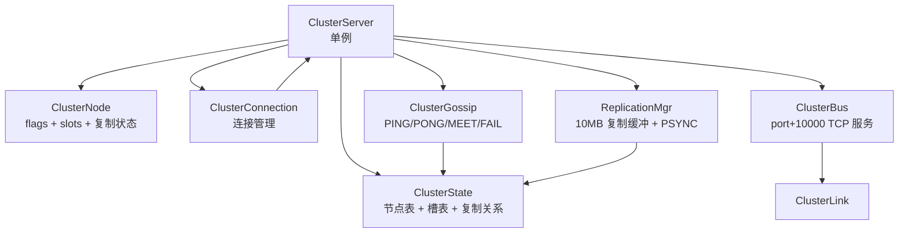
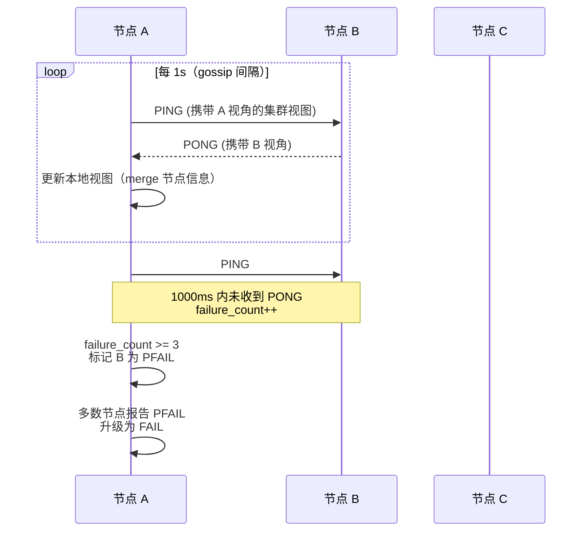
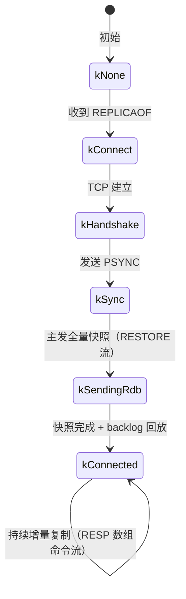
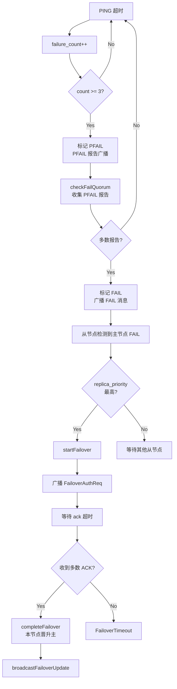

# 集群架构

> **范围**：16384 哈希槽分片、Gossip 协议、主从复制、故障检测与故障转移、ClusterBus 节点通信。
> **源码**：`src/cluster/`
> **启用条件**：`conf/concurrentcache.conf` 设置 `cluster_enabled = true`
> **前置阅读**：[架构总览](./overview.md) · [网络层](./network.md)

## 1. 设计目标

| 目标 | 手段 |
|------|------|
| 横向扩展 | 16384 哈希槽（CRC16(key) % 16384） |
| 节点发现 | Gossip（PING/PONG/MEET） |
| 故障自动恢复 | 客观下线 + 投票 + 故障转移 |
| 数据高可用 | 主从复制 + 10MB 复制缓冲 |
| 客户端透明 | MOVED / ASK 重定向 |
| 节点通信隔离 | ClusterBus 监听 `port + 10000` |

## 2. 核心组件


```mermaid
flowchart TB
    CS[ClusterServer<br/>单例]
    CS --> ST[ClusterState<br/>节点表 + 槽表 + 复制关系]
    CS --> CN[ClusterNode<br/>flags + slots + 复制状态]
    CS --> CC[ClusterConnection<br/>连接管理]
    CS --> CB[ClusterBus<br/>port+10000 TCP 服务]
    CS --> CG[ClusterGossip<br/>PING/PONG/MEET/FAIL]
    CS --> RM[ReplicationMgr<br/>10MB 复制缓冲 + PSYNC]

    CB --> CL[ClusterLink]
    CG --> ST
    RM --> ST
    CC --> CS
```

### 2.1 `ClusterServer`（`src/cluster/cluster_server.{h,cpp}`）

| 职责 | 接口 |
|------|------|
| 节点生命周期 | `init()` / `start()` / `stop()` |
| 槽路由 | `keyToSlot(key)` / `getNodeByKey(key)` / `getNodeBySlot(slot)` |
| 重定向检查 | `checkRedirect(key)`（返回 MOVED/ASK RESP 字符串） |
| 主从关系 | `setReplicaOf(master_name)` / `clearReplicaOf()` |
| 故障检测 | `handleNodeTimeout(name)` / `markNodeAsFail(name)` |
| 故障转移 | `startFailover(master_name)` / `executeFailover()` |
| 投票 | `handleFailoverAuthRequest(...)` / `handleFailoverAuthAck(...)` |

**关键成员**：

| 成员 | 说明 |
|------|------|
| `enabled_` | 是否启用集群（读 `cluster_enabled` 配置） |
| `my_node_` | 本节点（`shared_ptr<ClusterNode>`） |
| `state_` | 集群状态（节点表 + 槽表 + 复制关系） |
| `connection_` | 连接管理器 |
| `gossip_` | Gossip 协议 |
| `cluster_bus_` | 集群总线（监听 `port + 10000`） |
| `running_` | 运行标志 |

### 2.2 `ClusterState`（`src/cluster/cluster_state.{h,cpp}`）

| 成员 | 类型 | 锁 |
|------|------|---|
| `nodes_` | `unordered_map<string, shared_ptr<ClusterNode>>` | `std::shared_mutex` |
| `slots_` | `unordered_map<int, shared_ptr<ClusterNode>>`（16384 项） | `slots_mutex_` |
| `migrating_slots_` | `unordered_map<int, SlotMigrationInfo>` | `migration_mutex_` |
| `importing_slots_` | `unordered_map<int, SlotMigrationInfo>` | `migration_mutex_` |
| `replicas_` | `unordered_map<string, vector<shared_ptr<ClusterNode>>>` | `replicas_mutex_` |
| `pfailing_reports_` | `unordered_map<string, unordered_set<string>>` | `pfail_mutex_` |

**为什么用 `shared_ptr` 存槽？** 同一节点可能被多个槽引用，存指针避免 `unordered_map<int, ClusterNode>` 时的二次查找。

### 2.3 `ClusterNode`（`src/cluster/cluster_node.{h,cpp}`）

| 字段 | 类型 | 说明 |
|------|------|------|
| `info_` | `NodeInfo` | 基础信息（name/ip/port/role/flags/心跳时间） |
| `slots_` | `vector<int>` + `mutex` | 该节点负责的槽 |
| `master_node_` | `weak_ptr<ClusterNode>` | 副本的主节点 |
| `replication_state_` | `ReplicationState` | 复制阶段 |
| `failure_count_` | `atomic<int>` | PING 失败计数 |
| `failover_state_` | `atomic<int>` | 故障转移状态 |
| `votes_` | `vector<VoteInfo>` + `votes_mutex_` | 收到的投票 |

**`NodeFlags`**（位掩码）：

| Flag | 含义 |
|------|------|
| `kFail` | 客观下线（已通过投票确认） |
| `kPfail` | 主观下线（单个节点认为该节点不可达） |
| `kHandshake` | 正在握手 |
| `kNoAddress` | 地址未知 |

## 3. 哈希槽分片


```mermaid
flowchart LR
    K[key] --> CRC[CRC16]
    CRC --> MOD[mod 16384]
    MOD --> SLOT[slot 0-16383]
    SLOT --> NODE[ClusterNode]
```

**算法**：

```cpp
int ClusterServer::keyToSlot(const std::string& key) const {
    // 简化版：CRC16(key) % 16384
    // Redis 实际用 CRC16-CCITT，多项式 0x1021
    // 当前实现见 cluster_server.cpp
    return state_.getNodeForSlot(slot) ? ... : 0;
}
```

**为什么是 16384？** Redis Cluster 设计选择。2^14 = 16384 是权衡后的结果：

- 节点数 ≤ 1000 时每节点约 16 个槽，迁移粒度合适
- 心跳消息中用 2KB 位图（16384 bits = 2048 bytes）即可表示完整槽分配

**槽迁移状态**（`SlotMigrationInfo`）：

```cpp
struct SlotMigrationInfo {
    int slot = -1;
    SlotMigrationStatus status = SlotMigrationStatus::kNone;
    std::string source_node;   // 迁出节点
    std::string target_node;   // 迁入节点
};
```

**MOVED vs ASK 重定向**：

| 状态 | 含义 | 响应 |
|------|------|------|
| 槽已迁出 | 客户端应长期重定向 | `-MOVED slot ip:port\r\n` |
| 槽正在迁入 | 客户端应本次请求重定向 | `-ASK slot ip:port\r\n` |

## 4. Gossip 协议

### 4.1 消息类型（`GossipType`）

| 类型 | 值 | 方向 | 用途 |
|------|---|------|------|
| `kPing` | 1 | → 邻居 | 心跳 |
| `kPong` | 2 | → 邻居 | 心跳响应 |
| `kMeet` | 3 | → 新节点 | 加入集群 |
| `kFail` | 4 | 广播 | 节点下线广播 |
| `kFailoverAuthReq` | 5 | 广播 | 故障转移投票请求 |
| `kFailoverAuthAck` | 6 | 广播 | 投票确认 |
| `kPush` | 7 | → 邻居 | 推送本节点信息 |
| `kPull` | 8 | → 邻居 | 拉取本节点信息 |

### 4.2 心跳流程


```mermaid
sequenceDiagram
    participant A as 节点 A
    participant B as 节点 B
    participant C as 节点 C

    loop 每 1s（gossip 间隔）
        A->>B: PING (携带 A 视角的集群视图)
        B-->>A: PONG (携带 B 视角)
        A->>A: 更新本地视图（merge 节点信息）
    end

    A->>B: PING
    Note over A,B: 1000ms 内未收到 PONG<br/>failure_count++

    A->>A: failure_count >= 3<br/>标记 B 为 PFAIL
    A->>A: 多数节点报告 PFAIL<br/>升级为 FAIL
```

### 4.3 `ClusterGossip`（`src/cluster/cluster_gossip.{h,cpp}`）

| 关键方法 | 作用 |
|---------|------|
| `init(state)` | 初始化（持有 state 指针） |
| `build_ping/pong/meet_msg()` | 构造 Gossip 消息 |
| `handle_ping/pong/meet/fail/...` | 处理收到的消息 |
| `send_gossip(msg)` | 发送给随机邻居 |
| `broadcast_fail(name)` | 广播下线消息 |
| `get_random_nodes(count)` | 选 gossip 目标 |
| `push_node_info(node)` / `pull_node_info()` | 配置传播 |

## 5. 主从复制

### 5.1 复制状态机


```mermaid
stateDiagram-v2
    [*] --> kNone: 初始
    kNone --> kConnect: 收到 REPLICAOF
    kConnect --> kHandshake: TCP 建立
    kHandshake --> kSync: 发送 PSYNC
    kSync --> kSendingRdb: 主发全量快照（RESTORE 流）
    kSendingRdb --> kConnected: 快照完成 + backlog 回放
    kConnected --> kConnected: 持续增量复制（RESP 数组命令流）
```

> `kSendingRdb` 期间主节点收到的写命令进入该副本的 `pending_commands` backlog，快照发送完成后按序回放再切换到 `kConnected`——快照期间没有丢失窗口。

### 5.2 `ReplicationMgr`（`src/cluster/replication_mgr.{h,cpp}`）

| 成员 | 类型 | 说明 |
|------|------|------|
| `replicas_` | `unordered_map<string, shared_ptr<ReplicaInfo>>` | 副本列表（主端维护） |
| `repl_buffer_` | `vector<ReplicationBufferEntry>` | 10MB 环形缓冲 |
| `master_repl_offset_` | `atomic<int64_t>` | 主节点当前偏移量 |
| `sync_state_` | `atomic<SyncState>` | 副本端同步阶段 |
| `master_ip_/port_/runid_` | string/int | 副本端记录的主节点 |

**`ReplicaInfo`**：

```cpp
struct ReplicaInfo {
    std::string name;
    std::string ip;
    int port;
    int64_t repl_offset;
    int64_t last_ack_time;
    SyncState sync_state;
    std::shared_ptr<ClusterNode> node;
    std::vector<std::string> pending_commands;  // 全量同步期间的写命令 backlog
};
```

**环形缓冲**：

```cpp
static constexpr size_t kReplicationBufferSize = 10 * 1024 * 1024;  // 10MB
std::vector<ReplicationBufferEntry> repl_buffer_;
```

**复制流程**：

```text
主端：
  1. 收到写命令 → 编码为 RESP 数组（RespEncoder::encode_array）
     → replicate_command(cmd) 写 repl_buffer_
  2. kSendingRdb 副本：命令进该副本的 pending_commands backlog
  3. kConnected 副本：立即推送增量命令
  4. 全量同步（send_rdb_to_replica）：
     逐 key 发送 "RESTORE key ttl_ms serialized REPLACE"（RESP 数组，
     保留 LIST/HASH/SET/ZSET 类型并携带 TTL），
     完成后回放 backlog → 置 kConnected

副本端：
  1. handle_replication_command(cmd_line)
     优先按 RESP 数组解析（二进制安全）；旧格式（空格分割）仅作兼容回退
  2. 在本地执行相同命令
  3. 回复 REPLCONF ACK offset
```

**为什么复制命令必须是 RESP 数组而不是空格拼接？** value 可能包含空格、`\xC0`（bus 参数分隔符）、`\n`（`serialize()` 多行文本）——文本拼接会被截断/错位，RESP bulk string 自带长度前缀，完全二进制安全。

### 5.3 复制协议命令

| 命令 | 方向 | 用途 |
|------|------|------|
| `PSYNC ? -1` | 副本 → 主 | 全量同步请求 |
| `PSYNC <runid> <offset>` | 副本 → 主 | 增量同步请求 |
| `+FULLRESYNC <runid> <offset>` | 主 → 副本 | 全量同步响应（RESTORE 流跟随） |
| `+CONTINUE` | 主 → 副本 | 增量同步成功 |
| `REPLSYNC:<replica_name>` | 副本 → 主 | bus 侧全量同步触发（kRepData） |
| `REPLCONF listening-port <port>` | 副本 → 主 | 注册端口 |
| `REPLCONF ACK <offset>` | 副本 → 主 | 确认偏移 |

## 6. 故障检测与转移

### 6.1 客观下线算法


```mermaid
flowchart TB
    A[PING 超时] --> B[failure_count++]
    B --> C{count >= 3?}
    C -->|Yes| D[标记 PFAIL<br/>PFAIL 报告广播]
    C -->|No| A
    D --> E[checkFailQuorum<br/>收集 PFAIL 报告]
    E --> F{多数报告?}
    F -->|Yes| G[标记 FAIL<br/>广播 FAIL 消息]
    F -->|No| A

    G --> H[从节点检测到主节点 FAIL]
    H --> I{replica_priority<br/>最高?}
    I -->|Yes| J[startFailover]
    I -->|No| K[等待其他从节点]
    J --> L[广播 FailoverAuthReq]
    L --> M[等待 ack 超时]
    M --> N{收到多数 ACK?}
    N -->|Yes| O[completeFailover<br/>本节点晋升主]
    N -->|No| P[FailoverTimeout]
    O --> Q[broadcastFailoverUpdate]
```

### 6.2 关键不变量

- **故障检测参数**（`FailureDetectionConfig`）：

  ```cpp
  int64_t node_timeout_ms = 5000;
  int max_ping_failures = 3;
  int quorum = 2;  // 多数（> N/2）
  ```

- **故障转移参数**（`FailoverConfig`）：

  ```cpp
  int64_t failover_timeout_ms = 30000;
  int64_t auth_timeout_ms = 5000;
  int replica_priority = 100;
  ```

- 同一 epoch 内只能有一个从节点发起投票请求成功（避免脑裂）

## 7. ClusterBus 节点通信

| 项 | 值 |
|----|---|
| 监听端口 | `server_port + 10000`（默认 16379 + 10000 = 26379） |
| 协议 | TCP + 自定义二进制帧 |
| 用途 | 节点间消息转发（PING/PONG/FAIL/复制命令） |

**为什么 +10000？** 与 Redis Cluster 约定一致，方便客户端识别集群端口。

### 7.1 帧格式（`ClusterMsgHeader`）

```cpp
struct ClusterMsgHeader {
    uint32_t magic;           // 0x43 ('C')
    uint16_t version;         // 协议版本 = 1
    uint16_t type;            // ClusterMsgType
    uint32_t length;          // 帧总长度（含 header，单位字节）
    uint64_t sender_epoch;
    char sender_name[40];
    uint16_t flags;
    uint16_t port;
    uint32_t state;
    uint8_t slot_map[2048];   // 预留槽位图
};                            // sizeof = 2120（length 落在对齐空隙，格式大小未变）
```

header 之后是参数区，各参数以 `\xC0` 分隔。

**接收端校验**（`ClusterLink::read_complete`）：

| 检查 | 失败处理 |
|------|---------|
| `magic != 0x43` | 跳过非集群字节（容忍握手数据混入） |
| `length < sizeof(header)`（即 < 2120） | 协议错误 → **断开连接** |
| `length > 256MB` | 协议错误 → **断开连接** |
| 缓冲区数据 < `length` | 等待更多数据（半包） |

> **为什么 length 必须有下限校验？** 若 `length < header`，帧被判定"完整"但解码消费 0 字节，`while (read_complete())` 永不退出——单个畸形包就能把 EventLoop 线程打到 100% CPU 死循环（远程 DoS）。`length` 为 uint32（此前是 uint16），复制大 value（>64KB）不会回绕截断。

### 7.2 `ClusterLink` 生命周期

`ClusterLink` 是单条节点间 TCP 连接，负责消息编解码、异步发送、心跳协同。

**断开协议**（防止 UAF 的固定顺序，`disconnect_and_notify()`）：

```text
1. CAS 置 connected_ = false     → 之后所有事件回调直接返回
2. close(fd)
3. 触发 disconnect_callback_     → 回调可能销毁 this
4. 回调返回后绝不访问任何成员
```

所有断开路径（读错误 / 对端关闭 / 写错误 / 协议错误）都必须走这个顺序；`handle_write` 在持有 `send_mutex_` 时只置断开标志，解锁后再触发回调（回调里的析构会再拿这把锁）。bus 侧（`ClusterBus`）在断开回调中销毁 link 并**注销其 Channel**；下游回调收到的 link 参数为 `nullptr`（bus 自管的 Channel 由 bus 注销，自连链路由 `ClusterConnection` 注销）。

## 8. 客户端重定向

`ClusterServer::checkRedirect(key)` 在命令执行前调用：

```cpp
std::string ClusterServer::checkRedirect(const std::string& key) const {
    int slot = keyToSlot(key);
    auto target = state_.getNodeForSlot(slot);
    if (target->getName() == my_node_name) {
        return "";  // 本节点负责，直接执行
    }
    if (state_.isSlotMigrating(slot)) {
        return RespEncoder::encode_error("ASK ...");
    }
    return RespEncoder::encode_error("MOVED ...");
}
```

**客户端应做**：

- 收到 `MOVED`：更新本地槽映射表，永久重定向到目标节点
- 收到 `ASK`：仅本次请求重定向到目标节点（不更新映射）

## 9. 关键不变量

| 不变量 | 维护机制 |
|--------|---------|
| 槽数 = 16384 | CRC16 mod 16384 |
| 单实例 | `ClusterServer::instance()` Magic Static |
| 槽表与节点表一致 | 所有修改都加 `slots_mutex_` + `mutex_` |
| 同一时刻只有一个从节点晋升 | epoch 单调递增 + 投票多数 |
| 复制不丢命令 | 快照期 backlog + 10MB 环形缓冲 + offset 确认 |
| 复制流二进制安全 | 命令以 RESP 数组编码传输（长度前缀，无歧义分隔） |
| 非法 bus 帧不阻塞事件循环 | `length` 下限/上限校验，违规即断链 |
| Link 销毁不产生悬空回调 | `disconnect_and_notify()` 固定断开顺序 + bus 注销 Channel |
| 网络消息解析异常不杀进程 | gossip 安全解析 + kRepData 执行 catch + EventLoop 兜底 catch |
| 客户端最终能拿到数据 | MOVED 重定向 + 客户端缓存槽表 |
| 节点通信与客户端通信隔离 | `ClusterBus` 监听 `port + 10000` |

## 10. 配置

`conf/concurrentcache.conf`：

```ini
cluster_enabled = true
cluster_node_timeout = 5000
```

`CLUSTER MEET <ip> <port>` 动态加入集群（`cluster_cmd.cpp`）。

## 11. 性能与调优

| 现象 | 排查 / 调优 |
|------|------|
| 心跳消息过大 | 减少 `get_random_nodes` count |
| 频繁 FAIL 抖动 | 调大 `max_ping_failures` |
| 故障转移慢 | 调小 `failover_timeout_ms` |
| 复制延迟高 | 调大 `kReplicationBufferSize` |
| 槽分布不均 | 用 `CLUSTER REBALANCE` 重分配 |
| 脑裂 | 确认 `quorum > N/2` |

## 12. 关键源码位置

| 关注点 | 文件 |
|--------|------|
| 槽路由 | `src/cluster/cluster_server.cpp`（`keyToSlot/getNodeByKey`） |
| 节点管理 | `src/cluster/cluster_state.cpp`（`addNode/setNodeForSlot`） |
| 心跳 | `src/cluster/cluster_gossip.cpp`（`handle_ping/pong`） |
| 复制缓冲 | `src/cluster/replication_mgr.cpp`（`replicate_command/add_to_replication_buffer`） |
| 全量同步 | `src/cluster/replication_mgr.cpp`（`send_rdb_to_replica`：RESTORE 流 + backlog 回放） |
| 故障转移 | `src/cluster/cluster_server.cpp`（`startFailover/executeFailover`） |
| 帧编解码/校验 | `src/cluster/cluster_link.cpp`（`read_complete/decode_msg`） |
| Link 断开顺序 | `src/cluster/cluster_link.cpp`（`disconnect_and_notify`） |
| 节点通信 | `src/cluster/cluster_bus.cpp`（`handle_accept/create_link/remove_link`） |
| 客户端命令 | `src/command/cluster_cmd.cpp`（`CLUSTER MEET/SLOTS/NODES`） |
| 复制协议 | `src/command/psync_cmd.cpp`（`PSYNC`） |

## 13. 另见

- [API § 集群命令](../api.md)
- [部署 § 集群部署](../deployment.md)
- [测试 § 集群测试](../testing.md)
