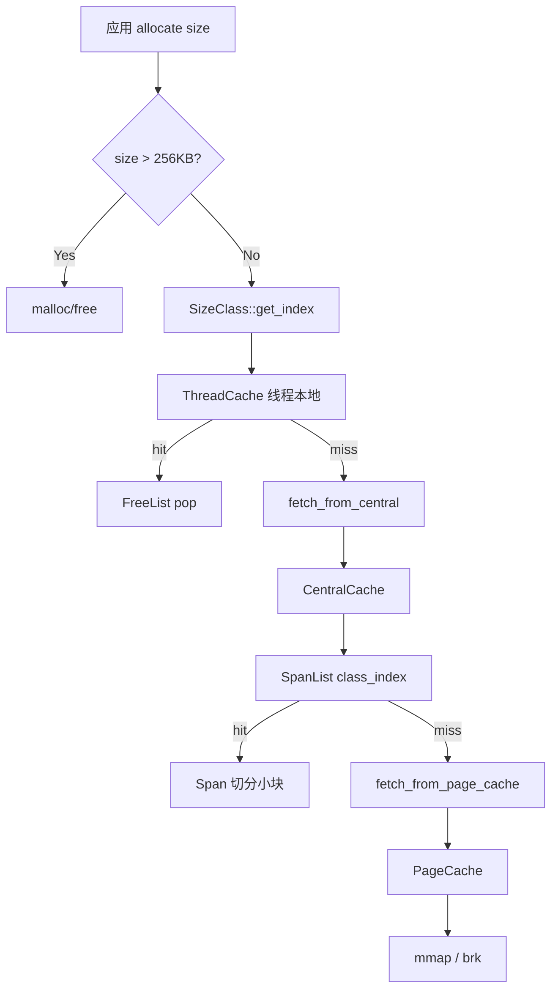
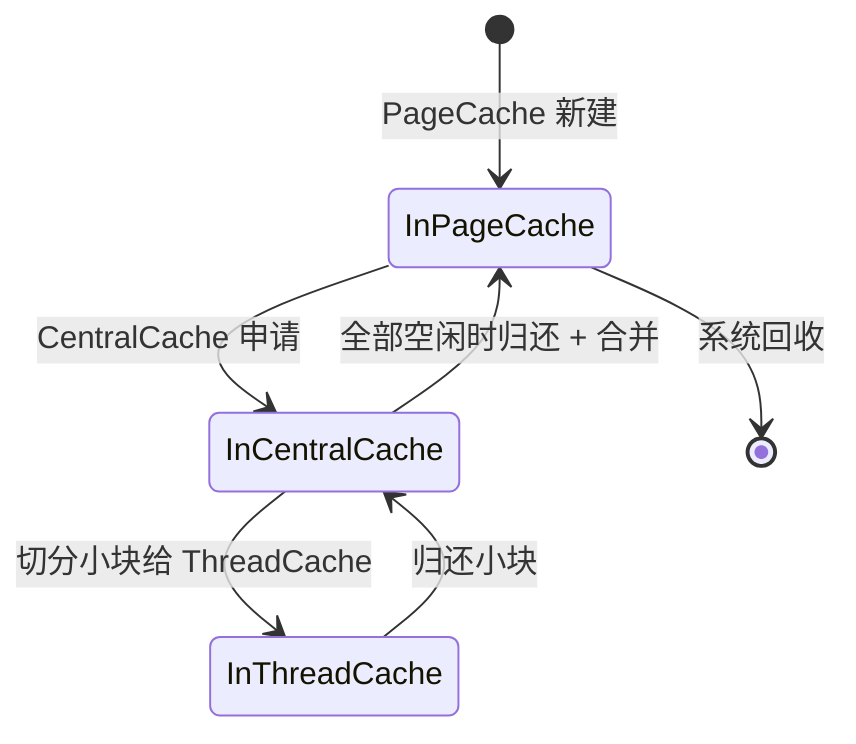

# 内存池架构

> **范围**：三级内存池（ThreadCache → CentralCache → PageCache）、29 级 SizeClass、Span 管理、合并策略。
> **源码**：`src/memorypool/`
> **前置阅读**：[架构总览](./overview.md)

## 1. 设计目标

| 目标 | 手段 |
|------|------|
| 减少 `malloc/free` 系统调用 | 应用层对象池 |
| 减少多线程锁竞争 | 线程本地 ThreadCache（无锁） |
| 减少内存碎片 | Span 合并（按页合并相邻空闲块） |
| 控制内存峰值 | CentralCache 集中协调 + PageCache 系统交互 |
| 适用所有大小 | 8B ~ 256KB 走池化，>256KB 直 malloc |

## 2. 总体架构



**三级关系**：

| 层级 | 锁粒度 | 作用 |
|------|--------|------|
| L1 ThreadCache | **无锁**（`thread_local`） | 缓存线程热点小对象 |
| L2 CentralCache | **每个 SizeClass 一把锁** | 跨线程协调 Span |
| L3 PageCache | **全局一把锁** | 与系统交互 + Span 合并 |

## 3. SizeClass（`src/memorypool/size_class.h`）

29 级固定大小档次，覆盖 8B ~ 256KB：

| Index | Bytes | Index | Bytes | Index | Bytes |
|-------|-------|-------|-------|-------|-------|
| 0 | 8 | 10 | 512 | 20 | 16,384 |
| 1 | 16 | 11 | 768 | 21 | 24,576 |
| 2 | 32 | 12 | 1,024 | 22 | 32,768 |
| 3 | 48 | 13 | 1,536 | 23 | 49,152 |
| 4 | 64 | 14 | 2,048 | 24 | 65,536 |
| 5 | 96 | 15 | 3,072 | 25 | 98,304 |
| 6 | 128 | 16 | 4,096 | 26 | 131,072 |
| 7 | 192 | 17 | 6,144 | 27 | 196,608 |
| 8 | 256 | 18 | 8,192 | 28 | 262,144 |
| 9 | 384 | 19 | 12,288 | | |

**设计原则**：小对象档次密集（间隔 1.5×~2×），大对象档次稀疏（间隔 2×）。小对象申请频率高、需要更精细的分类以减少内部碎片。

**API**：

```cpp
static size_t SizeClass::get_index(size_t size);   // 向上取整到最近档
static size_t SizeClass::get_size(size_t index);   // 查表
static size_t SizeClass::round_up(size_t size);    // 实际分配大小
```

> 示例：`round_up(50) = 64`（第 4 档），`round_up(1000) = 1024`（第 12 档）。

## 4. ThreadCache（`src/memorypool/thread_cache.{h,cpp}`）

| 特性 | 值 |
|------|---|
| 实例 | 每线程一个（`thread_local`） |
| 锁 | **无** |
| 结构 | `std::vector<FreeList> free_lists_`（29 个） |

**获取**：

```cpp
static ThreadCache* ThreadCache::get_instance();   // thread_local 单例
```

**分配**（`allocate(size)`）：

```text
1. class_index = SizeClass::get_index(size)
2. if free_lists_[class_index] 不空: pop 一块返回（无锁）
3. 否则 fetch_from_central(class_index) 批量获取
```

**释放**（`deallocate(obj, size)`）：

```text
1. class_index = SizeClass::get_index(size)
2. push 到 free_lists_[class_index]
3. 若该 FreeList 超过阈值：return_to_central(class_index) 批量归还
```

**为什么无锁？** `thread_local` 变量每个线程独立。`SubReactor` 线程、`ExpirationChecker` 线程、`ThreadPool` 工作线程各自有独立实例，互不干扰。

## 5. CentralCache（`src/memorypool/central_cache.{h,cpp}`）

| 特性 | 值 |
|------|---|
| 实例 | 全局单例 |
| 锁 | 29 把独立 `Mutex`（`std::vector<Mutex> locks_`） |
| 结构 | `std::vector<SpanList> span_lists_`（29 个 SpanList） |

**细粒度锁**：每个 SizeClass 独立锁，不同 SizeClass 的访问完全并行。

**分配**（`allocate(class_index)`）：

```text
lock(locks_[class_index])
1. if span_lists_[class_index] 非空:
     取一个 Span，切出小块放入 ThreadCache，Span 放回
     return 小块地址
2. else:
     fetch_from_page_cache(class_index)  // 加锁由 PageCache 处理
     goto 1
```

**释放**（`deallocate(obj, class_index)`）：

```text
lock(locks_[class_index])
1. 找到 obj 所属 Span
2. push 到 Span->free_list_
3. if Span 全部空闲：free_span(span)  // 归还给 PageCache
```

## 6. PageCache（`src/memorypool/page_cache.{h,cpp}`）

| 特性 | 值 |
|------|---|
| 实例 | 全局单例 |
| 锁 | **全局一把** `Mutex` |
| 结构 | `std::map<uint64_t, Span*>` + `std::map<size_t, SpanList>` |

**为什么全局锁？** PageCache 操作频率远低于 CentralCache（Span 级别 vs 小块级别），且涉及跨 SizeClass 的合并，全局锁开销可接受。

**分配**（`allocate_span(num_pages)`）：

```text
lock(mutex_)
1. if free_span_lists_[num_pages] 非空: pop 返回
2. else 向系统申请 num_pages 页（mmap / brk），封装为 Span 返回
```

**释放 + 合并**（`free_span(span)`）：

```text
lock(mutex_)
1. coalesce_span(span)  // 关键：合并相邻空闲 Span
2. 按 num_pages 插入 free_span_lists_
```

**Span 合并（`coalesce_span`）**：

```text
输入：刚释放的 Span
1. 在 page_span_map_ 查 page_id - 1 的 Span，若空闲 → 合并到前面
2. 在 page_span_map_ 查 page_id + num_pages 的 Span，若空闲 → 合并到后面
3. 更新合并后 Span 的 page_id_、num_pages_，并从原 page_span_map_ 移除旧 Span
返回：合并后的 Span
```

**为什么合并重要？** 减少外部碎片。例如连续 4 页、4 页、4 页 单独释放后再次申请 12 页会失败；合并后可以满足。

## 7. Span（`src/memorypool/span.h`）

```cpp
struct Span {
    uint64_t page_id_;       // 起始页号（一页 = 4KB）
    size_t num_pages_;       // Span 包含的页数
    size_t size_class_;      // 对应 SizeClass 索引
    void* free_list_;        // Span 内空闲小块链表头
    size_t free_count_;      // 空闲小块数量
    Span* next_;             // 双向链表指针
    Span* prev_;
};
```

**SpanList**：双向循环链表（带哨兵节点），管理同一 SizeClass 的所有 Span。

**Span 生命周期**：



## 8. 公共 API（`src/memorypool/memory_pool.h`）

```cpp
class MemoryPool {
public:
    static void* allocate(size_t size);   // 入口
    static void  deallocate(void* ptr, size_t size);
};

// 便捷宏
#define MALLOC(size)    cc_server::MemoryPool::allocate(size)
#define FREE(ptr, size) cc_server::MemoryPool::deallocate(ptr, size)
```

**分配规则**：

```cpp
void* MemoryPool::allocate(size_t size) {
    if (size > SizeClass::kSizeClasses[SizeClass::kNumClasses - 1]) {
        return malloc(size);  // >256KB 直 malloc
    }
    size_t class_index = SizeClass::get_index(size);
    if (class_index == -1) return malloc(size);
    return ThreadCache::get_instance()->allocate(size);
}
```

## 9. 关键不变量

| 不变量 | 维护机制 |
|--------|---------|
| 同 SizeClass 内小块大小一致 | `SizeClass::round_up` 统一向上取整 |
| ThreadCache 跨线程隔离 | `thread_local` 关键字 |
| CentralCache 跨 SizeClass 并行 | 29 把独立锁 |
| PageCache 合并无遗漏 | 全局锁保护 `page_span_map_` |
| Span 不会双重释放 | `page_span_map_` 在 `free_span` 中先移除 |
| >256KB 不进池 | 入口 `if (size > 256KB) malloc` |
| 内存释放对称 | `FREE(ptr, size)` 必须传入与 `MALLOC` 相同的 `size` |

## 10. 性能与调优

| 现象 | 排查 | 调优 |
|------|------|------|
| `malloc` 比例高 | 检查是否大量 >256KB 对象 | 拆分大对象为小块 |
| ThreadCache miss 高 | 该 SizeClass 阈值太小 | 调大批量获取数 |
| CentralCache 锁竞争 | `tsan` 报告 | 拆分 SizeClass（需重构） |
| PageCache 锁阻塞 | 检查 `coalesce_span` 频率 | 减少单次合并范围 |
| 内存峰值不释放 | PageCache 未及时归还 Span | 调小 Span 空闲阈值 |

## 11. 关键源码位置

| 关注点 | 文件 |
|--------|------|
| SizeClass 档位表 | `src/memorypool/size_class.h`（`kSizeClasses[]`） |
| ThreadCache 批量获取 | `src/memorypool/thread_cache.cpp`（`fetch_from_central`） |
| CentralCache 切分 | `src/memorypool/central_cache.cpp`（`allocate`） |
| PageCache 合并 | `src/memorypool/page_cache.cpp`（`coalesce_span`） |
| Span 链表操作 | `src/memorypool/span.cpp`（`SpanList::push_back/remove`） |
| FreeList 操作 | `src/memorypool/free_list.cpp`（`push/pop`） |

## 12. 另见

- [存储层](./storage.md) — 主要消费者
- [网络层](./network.md) — Buffer 也是堆对象
