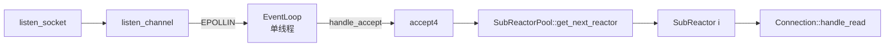
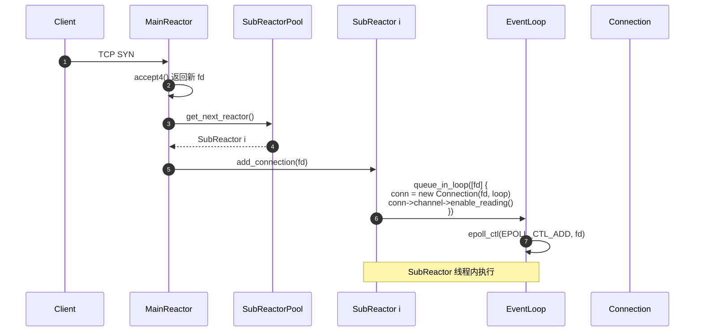
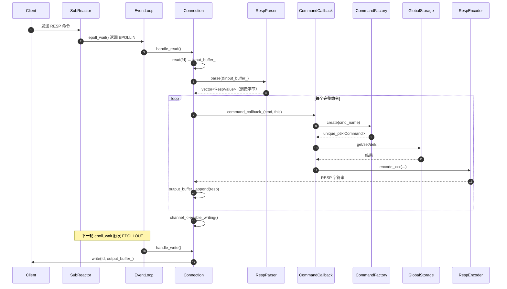
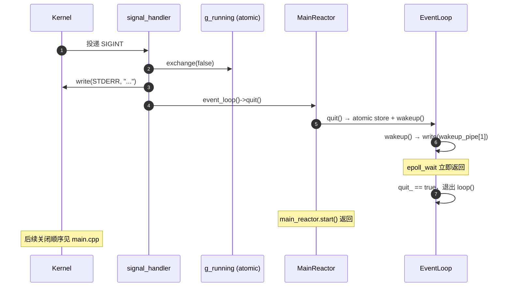

# 网络层架构

> **范围**：MainReactor、SubReactorPool、EventLoop、Connection、Channel、Buffer 的设计、协作与时序。
> **源码**：`src/network/`
> **前置阅读**：[架构总览](./overview.md)

## 1. 设计目标

| 目标 | 手段 |
|------|------|
| 支撑 10K+ 并发长连接 | Linux epoll LT 模式 + 边缘触发兜底 |
| 充分利用多核 | MainSubReactor 分工：1 个 MainReactor accept + N 个 SubReactor 处理 I/O |
| 避免单线程瓶颈 | `SubReactorPool` 轮询分发 |
| 跨线程安全唤醒 | 每个 `EventLoop` 自带 `wakeup pipe` |
| 信号安全退出 | SIGINT/SIGTERM → atomic store + `EventLoop::quit()` |
| 协议无关 | `Connection` 不解析协议，只做 I/O + 缓冲 |

## 2. 核心组件

### 2.1 MainReactor

| 项 | 值 |
|----|---|
| 线程数 | **1**（单线程） |
| 职责 | 监听端口、accept 新连接、分发到 SubReactorPool |
| 源码 | `src/network/main_reactor.{h,cpp}` |



**关键流程**（`main_reactor.cpp::handle_accept`）：

1. `epoll_wait` 返回 listen socket 可读
2. 循环 `accept4()` 直到 `EAGAIN`
3. 对每个新 fd：调用 `SubReactorPool::get_next_reactor()` 获取下一个 SubReactor
4. 调用 `sub_reactor->add_connection(fd)`：在对应 SubReactor 线程内创建 `Connection` 并注册到该 SubReactor 的 `EventLoop`

### 2.2 SubReactorPool

| 项 | 值 |
|----|---|
| 线程数 | `reactor_count`（配置，默认 = CPU 核数） |
| 职责 | 持有 N 个 SubReactor，轮询负载均衡 |
| 源码 | `src/network/sub_reactor_pool.{h,cpp}` |
| 线程安全 | `std::atomic<size_t> next_index_` 轮询 |

```cpp
// 轮询算法（极简高效）
SubReactor* SubReactorPool::get_next_reactor() {
    size_t idx = next_index_.fetch_add(1, std::memory_order_relaxed)
                 % reactors_.size();
    return reactors_[idx].get();
}
```

**注**：使用 `fetch_add` 原子自增取模实现无锁负载均衡，多线程并发获取 SubReactor 互不阻塞。

### 2.3 SubReactor

| 项 | 值 |
|----|---|
| 线程数 | 1 个 OS 线程持有 1 个 `SubReactor` |
| 职责 | epoll I/O 多路复用、读写事件分发、连接生命周期管理 |
| 源码 | `src/network/sub_reactor.{h,cpp}` |
| 关键成员 | `EventLoop`、`connections_`（fd → `Connection`） |

**线程模型**：

```text
┌─────────────── SubReactor 线程 ───────────────┐
│  loop():                                     │
│    while (!quit_) {                          │
│      events = epoll_wait(...)                │
│      for each event:                         │
│        if fd == wakeup_fd_: handle_wakeup()  │
│        else: conn->handle_read/write()       │
│    }                                         │
└──────────────────────────────────────────────┘
```

**为什么 Connection 必须在 SubReactor 线程内创建？** 避免 `EventLoop` 跨线程访问 `epoll_fd_`。`SubReactor::add_connection(fd)` 中通过 `loop_->queue_in_loop()` 把 `Connection` 创建逻辑放到该 SubReactor 线程内执行。

### 2.4 EventLoop

| 项 | 值 |
|----|---|
| 数量 | 每个 SubReactor 1 个 + MainReactor 1 个 |
| 职责 | epoll 实例、wakeup pipe、Channel 注册表、quit 标志 |
| 源码 | `src/network/event_loop.{h,cpp}` |
| 头文件依赖 | `<sys/epoll.h>` `<unistd.h>` `<fcntl.h>` |

**关键成员**：

| 成员 | 作用 |
|------|------|
| `int epoll_fd_` | `epoll_create1()` 返回的 epoll 实例 |
| `int wakeup_pipe_[2]` | 跨线程唤醒；`[0]` 读端（注册到 epoll），`[1]` 写端（非阻塞） |
| `std::vector<epoll_event> events_` | `epoll_wait` 输出缓冲 |
| `std::unordered_map<int, Channel*> channels_` | fd → Channel 反向索引（事件分发用） |
| `std::atomic<bool> quit_` | 退出标志 |
| `std::mutex channels_mutex_` | 保护 `channels_` map（跨线程注册安全） |

**事件循环伪代码**（`event_loop.cpp::loop()`）：

```cpp
void EventLoop::loop() {
    while (!quit_.load(std::memory_order_acquire)) {
        int n = epoll_wait(epoll_fd_, events_.data(),
                          events_.size(), 100 /*ms*/);
        for (int i = 0; i < n; ++i) {
            if (events_[i].data.fd == wakeup_fd_) {
                handle_wakeup();   // 消费 pipe 中的字节
            } else {
                auto* ch = channels_[events_[i].data.fd];
                ch->set_triggered_events(events_[i].events);
                ch->handle_event();  // 分发到读/写/错误回调
            }
        }
    }
}
```

**epoll 模式**：使用 **LT（Level Trigger）** 模式。优点是编码简单、不漏事件；代价是同一事件可能多次唤醒，但本项目通过非阻塞 fd + 处理完即 `disable_all` 或业务侧消费完整 buffer 来避免忙循环。

**跨线程唤醒**（`wakeup()`）：

```cpp
void EventLoop::wakeup() {
    char buf = 'x';
    [[maybe_unused]] ssize_t n = write(wakeup_pipe_[1], &buf, 1);
}
```

任何线程调用 `event_loop->wakeup()` 都会让对应 `EventLoop` 立即从 `epoll_wait` 返回。用途：

- 跨线程投递任务
- `EventLoop::quit()` 主动唤醒
- 集群层 `ClusterConnection` 把任务投到 MainReactor 的 EventLoop

### 2.5 Channel

| 项 | 值 |
|----|---|
| 数量 | 1 个 fd 对应 1 个 Channel |
| 职责 | 封装 fd + 监听事件 + 4 类回调（read/write/error/close） |
| 源码 | `src/network/channel.{h,cpp}` |

**为什么需要 Channel？** `epoll_wait` 只告诉你"哪个 fd 就绪了什么事件"，但不直接关联业务对象。`Channel` 把 fd、事件、回调绑定在一起，由 `EventLoop` 统一调度。

**事件分发**（`channel.cpp::handle_event()`）：

```cpp
void Channel::handle_event() {
    if (triggered_events_ & (EPOLLIN | EPOLLPRI | EPOLLHUP))  read_cb_();
    if (triggered_events_ & EPOLLOUT)                         write_cb_();
    if (triggered_events_ & (EPOLLERR | EPOLLHUP))            error_cb_();
    if (closed_) close_callback_();
}
```

### 2.6 Connection

| 项 | 值 |
|----|---|
| 数量 | 每个 TCP 连接 1 个 |
| 线程亲和 | 严格归属于某个 SubReactor（生命周期 = 所属 SubReactor 持有 `unique_ptr`） |
| 职责 | Socket 封装、读写 Buffer、RESP 解析、命令分发、关闭回调 |
| 源码 | `src/network/connection.{h,cpp}` |

**成员**：

| 成员 | 作用 |
|------|------|
| `Socket client_socket_` | RAII 封装 fd，析构自动 close |
| `std::unique_ptr<Channel> channel_` | 该连接的 epoll 事件 Channel |
| `Buffer input_buffer_` | 接收 socket 数据；处理 TCP 粘包 |
| `Buffer output_buffer_` | 待发送的 RESP 响应 |
| `RespParser resp_parser_` | 增量解析 RESP 协议（`std::variant` 表示） |
| `CommandCallback command_callback_` | 由 `SubReactor::add_connection` 设置，命令处理入口 |

**读事件处理**（`connection.cpp::handle_read()`）：

```text
loop:
    n = read(fd, &input_buffer_[writable], free_space)
    if n == 0: close()  // FIN
    if n < 0 && EAGAIN: return  // 数据读完
    parse commands from input_buffer_
    for each command:
        command_callback_(cmd, this)  // 执行命令
    goto loop
```

**写事件处理**（`handle_write()`）：

```text
n = write(fd, output_buffer_.peek(), readable)
if n > 0: output_buffer_.retrieve(n)
if output_buffer_.readable == 0: channel_->disable_writing()  // 避免 busy loop
if n < 0 && EAGAIN: return  // 内核缓冲区满
```

### 2.7 Buffer

| 项 | 值 |
|----|---|
| 职责 | TCP 字节流缓冲；解决粘包/半包 |
| 源码 | `src/network/buffer.{h,cpp}` |
| 模型 | 双指针环形：`reader_idx_`（读端）、`writer_idx_`（写端） |

**关键 API**：

| 方法 | 作用 |
|------|------|
| `append(data, len)` | 写入 `writer_idx_` 位置；空间不够时 `ensure_writable()` 扩容 |
| `peek()` | 返回可读区起始指针（不消费） |
| `retrieve(len)` | 消费 `len` 字节（移动 `reader_idx_`） |
| `compact()` | 把未消费数据搬移到头部，腾出尾部空间 |

## 3. 协作时序

### 3.1 新连接建立



### 3.2 命令处理



### 3.3 信号优雅退出



**关键不变量**：

- `signal_handler` 中只调用 `write(STDERR_FILENO, ...)`（async-signal-safe），绝不使用 `std::cout` / `printf` / 任何分配内存的函数
- 业务关闭（`sub_reactor_pool->stop()`、`rdb_scheduler->stop()` 等）在 `main()` 主线程顺序执行

## 4. 线程模型

| 组件 | OS 线程 | 访问的共享状态 | 同步方式 |
|------|---------|---------------|---------|
| `MainReactor` | 1 个 | `SubReactorPool::get_next_reactor()` 的 `next_index_` | atomic |
| `SubReactor` | N 个 | 不共享 | 每线程持有自己的 `Connection` 表 |
| `ThreadPool` | `thread_pool_size` 个 | 任务队列 | mutex + condvar |
| `ExpirationChecker` | 1 个 | `GlobalStorage` 分片 | `std::shared_mutex` |
| `RdbScheduler` | 1 个 | `GlobalStorage` 分片 | `std::shared_mutex` + fork 隔离 |
| `ClusterServer` | 0（复用 MainReactor EventLoop） | `ClusterState` | `std::shared_mutex` 多把 |

**SPSC/SPSC 模式**：`SubReactor` 与 `Connection` 严格 1:1，避免任何锁。

## 5. 关键源码位置

| 关注点 | 文件 | 行/函数 |
|--------|------|---------|
| epoll 主循环 | `src/network/event_loop.cpp` | `EventLoop::loop()` |
| 跨线程唤醒 | `src/network/event_loop.cpp` | `EventLoop::wakeup()` |
| 监听 accept | `src/network/main_reactor.cpp` | `MainReactor::handle_accept()` |
| SubReactor 分发 | `src/network/main_reactor.cpp` | `MainReactor::add_new_connection()` |
| 轮询负载均衡 | `src/network/sub_reactor_pool.cpp` | `SubReactorPool::get_next_reactor()` |
| 连接 I/O | `src/network/connection.cpp` | `Connection::handle_read/write()` |
| 缓冲区操作 | `src/network/buffer.cpp` | `Buffer::append/retrieve/compact()` |

## 6. 调优建议

| 现象 | 调优点 |
|------|-------|
| accept 慢 | 提升 `MainReactor` 优先级 / 增大 `listen` backlog |
| 单 SubReactor 负载高 | 调大 `reactor_count`（默认 = CPU 核数） |
| 短连接 QPS 低 | 调大 `epoll_wait` 事件数组（`events_.resize(1024*16)`） |
| wakeup pipe 频繁 | 检查是否误用 `wakeup()` 投递非紧急任务 |
| 子线程卡死 | `gdb -p <pid>` → `thread apply all bt` 查锁持有者 |
