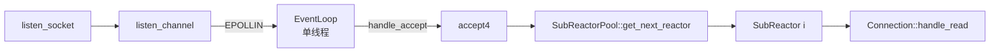
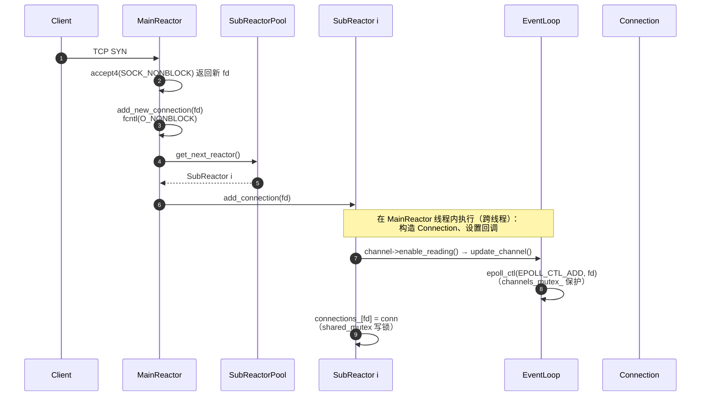
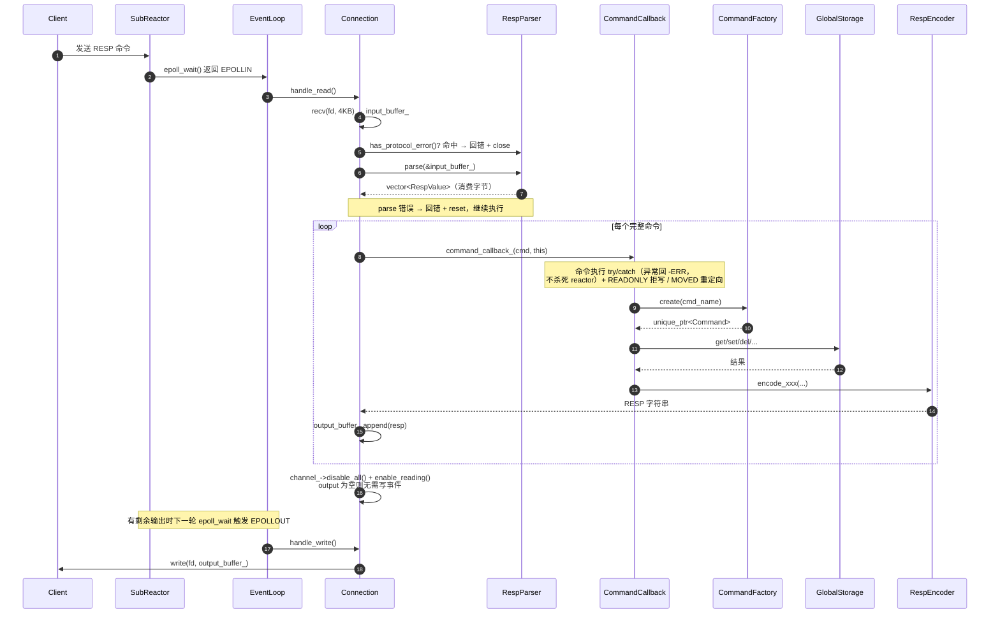
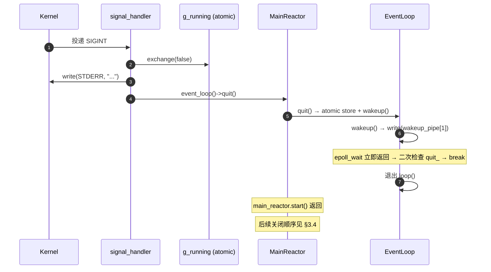
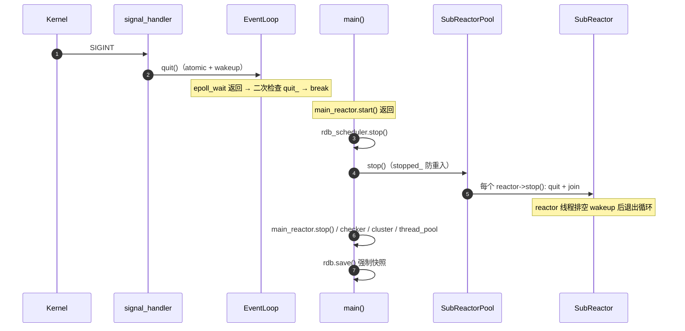

# 网络层架构

> **范围**：MainReactor、SubReactorPool、EventLoop、Connection、Channel、Buffer 的设计、协作与时序。
> **源码**：`src/network/`
> **前置阅读**：[架构总览](./overview.md)

## 1. 设计目标

| 目标 | 手段 |
|------|------|
| 支撑 10K+ 并发长连接 | Linux epoll **纯 LT** 模式（全仓库无 `EPOLLET`）+ 启动时 `setrlimit(RLIMIT_NOFILE)` 提到 65535 |
| 充分利用多核 | MainSubReactor 分工：1 个 MainReactor accept + N 个 SubReactor 处理 I/O |
| 避免单线程瓶颈 | `SubReactorPool` 轮询分发 |
| 跨线程安全唤醒 | 每个 `EventLoop` 自带 `wakeup pipe` |
| 信号安全退出 | SIGINT/SIGTERM → atomic store + `EventLoop::quit()` |
| 协议无关 | `Connection` 不解析协议，只做 I/O + 缓冲 |

## 2. 核心组件

### 2.1 MainReactor

| 项 | 值 |
|----|---|
| 线程数 | **1**（单线程） |
| 职责 | 监听端口、accept 新连接、分发到 SubReactorPool |
| 源码 | `src/network/main_reactor.{h,cpp}` |


```mermaid
flowchart LR
    LS[listen_socket] --> CH[listen_channel]
    CH -->|EPOLLIN| EL[EventLoop<br/>单线程]
    EL -->|handle_accept| ACC[accept4]
    ACC --> SRP[SubReactorPool::get_next_reactor]
    SRP --> NXT[SubReactor i]
    NXT --> CNC[Connection::handle_read]
```

**关键流程**（`main_reactor.cpp::handle_accept` → `add_new_connection`）：

1. `epoll_wait` 返回 listen socket 可读
2. 循环 `accept4(..., SOCK_NONBLOCK)` 直到 `EAGAIN`（日志打印客户端 ip）
3. 对每个新 fd：`add_new_connection(fd)` → 再次 `fcntl(O_NONBLOCK)` → `SubReactorPool::get_next_reactor()` 获取下一个 SubReactor
4. **在 MainReactor 线程内直接跨线程调用** `sub_reactor->add_connection(fd)`：创建 `Connection`、设置回调、`enable_reading()` 并注册到该 SubReactor 的 `EventLoop`（跨线程安全靠 `EventLoop::channels_mutex_` + `SubReactor::connections_mutex_`）

### 2.2 SubReactorPool

| 项 | 值 |
|----|---|
| 线程数 | `reactor_count`（配置，默认 = CPU 核数） |
| 职责 | 持有 N 个 SubReactor，轮询负载均衡 |
| 源码 | `src/network/sub_reactor_pool.{h,cpp}` |
| 线程安全 | `std::atomic<size_t> next_index_` 轮询 |

```cpp
// 轮询算法（极简高效）
SubReactor* SubReactorPool::get_next_reactor() {
    size_t idx = next_index_.fetch_add(1, std::memory_order_relaxed)
                 % reactors_.size();
    return reactors_[idx].get();
}
```

**注**：使用 `fetch_add` 原子自增取模实现无锁负载均衡，多线程并发获取 SubReactor 互不阻塞。

### 2.3 SubReactor

| 项 | 值 |
|----|---|
| 线程数 | 1 个 OS 线程持有 1 个 `SubReactor` |
| 职责 | 连接生命周期管理（创建/移除）、命令回调装配、关闭清理 |
| 源码 | `src/network/sub_reactor.{h,cpp}` |
| 关键成员 | `EventLoop`（组合）、`connections_`（fd → `Connection`，`shared_mutex` 保护）、`std::atomic<std::thread*> thread_`、`std::atomic<size_t> connection_count_`、`static create()` 工厂 |

**线程模型**：

```text
SubReactor 线程 = thread([this] { loop_->loop(); })
                                    │
                    ┌───────────────┴───────────────┐
                    │  EventLoop::loop()（见 §2.4）  │
                    │  epoll_wait / 事件分发全在此   │
                    └───────────────────────────────┘
```

SubReactor 本身没有 `loop()`/`epoll_wait`——线程体就是 `EventLoop::loop()`。事件分发全部发生在 EventLoop 内。

### 2.4 EventLoop

| 项 | 值 |
|----|---|
| 数量 | 每个 SubReactor 1 个 + MainReactor 1 个 |
| 职责 | epoll 实例、wakeup pipe、Channel 注册表、quit 标志 |
| 源码 | `src/network/event_loop.{h,cpp}` |
| 头文件依赖 | `<sys/epoll.h>` `<unistd.h>` `<fcntl.h>` |

**关键成员**：

| 成员 | 作用 |
|------|------|
| `int epoll_fd_` | `epoll_create1()` 返回的 epoll 实例 |
| `int wakeup_pipe_[2]` | 跨线程唤醒；`[0]` 读端（注册到 epoll），`[1]` 写端。**两端均 `O_NONBLOCK`**——读端非阻塞是 shutdown 死锁修复的关键（见 §3.4） |
| `std::vector<epoll_event> events_` | `epoll_wait` 输出缓冲，初始 65536，写满自动翻倍 |
| `std::unordered_map<int, Channel*> channels_` | fd → Channel 反向索引（事件分发用） |
| `std::atomic<bool> quit_` | 退出标志 |
| `std::mutex channels_mutex_` | 保护 `channels_` map（跨线程注册安全：MainReactor 线程会为 SubReactor 注册 Channel） |
| `time_t last_config_check_time_` | 配置热加载节流（每 10 秒检查一次，见下） |

**事件循环伪代码**（`event_loop.cpp::loop()`）：

```cpp
void EventLoop::loop() {
    while (!quit_.load(std::memory_order_acquire)) {
        check_config_reload();          // 距上次检查 ≥10s 才真正 reload
        if (quit_) break;               // 退出检查点 1
        int n = epoll_wait(epoll_fd_, events_.data(),
                           events_.size(), 100 /*ms*/);
        if (n < 0) {
            if (errno == EINTR) continue;
            break;                      // epoll 自身故障，退出循环
        }
        if (quit_) break;               // 退出检查点 2：quit 后最迟一轮就退出
        for (int i = 0; i < n; ++i) {
            if (events_[i].data.fd == wakeup_fd_) {
                handle_wakeup();   // 消费 pipe 中的字节
            } else {
                auto* ch = channels_.find(fd);   // 加锁查找
                if (ch == end) { LOG_WARN("Event for unknown fd"); continue; }
                ch->set_triggered_events(events_[i].events);
                try {
                    ch->handle_event();  // 分发到读/写/错误回调
                } catch (const std::exception& e) {
                    LOG_ERROR(...);      // 兜底 catch：一条畸形消息
                } catch (...) {          // 不允许杀死整个进程
                    LOG_ERROR(...);
                }
            }
        }
        if (n == events_.size()) events_.resize(events_.size() * 2);
    }
}
```

> **为什么事件分发要兜底 catch？** 回调链深处（客户端命令执行、cluster 消息解析）抛出的异常若一路上抛会触发 `std::terminate`——单个畸形输入不应能击穿服务器。异常在这里被吞掉并记录，事件循环继续。
>
> **为什么要有两个退出检查点？** 只在循环头检查的话，`quit()` 后最坏要等 100ms 超时或一轮事件处理完才退出；epoll_wait 返回后立即复查，保证 quit 最迟一轮生效——`join()` 不会卡住。

**配置热加载**（`check_config_reload()`）：复用事件循环 100ms 超时当定时器，距上次检查 ≥10 秒（`config_check_interval_`）才调 `Config::instance().reload()`，避免每轮都碰配置文件。

**epoll 模式**：使用 **LT（Level Trigger）** 模式。优点是编码简单、不漏事件；代价是同一事件可能多次唤醒，但本项目通过非阻塞 fd + 处理完即 `disable_all` 或业务侧消费完整 buffer 来避免忙循环。

**跨线程唤醒**（`wakeup()`）：

```cpp
void EventLoop::wakeup() {
    char buf = 'a';
    if (write(wakeup_pipe_[1], &buf, 1) < 0)
        LOG_ERROR("wakeup write() failed");
}
```

任何线程调用 `event_loop->wakeup()` 都会让对应 `EventLoop` 立即从 `epoll_wait` 返回。用途：

- 跨线程投递任务
- `EventLoop::quit()` 主动唤醒
- 集群层 `ClusterConnection` 把任务投到 MainReactor 的 EventLoop

### 2.5 Channel

| 项 | 值 |
|----|---|
| 数量 | 1 个 fd 对应 1 个 Channel |
| 职责 | 封装 fd + 监听事件 + 4 类回调（read/write/error/close） |
| 源码 | `src/network/channel.{h,cpp}` |

**为什么需要 Channel？** `epoll_wait` 只告诉你"哪个 fd 就绪了什么事件"，但不直接关联业务对象。`Channel` 把 fd、事件、回调绑定在一起，由 `EventLoop` 统一调度。

**事件分发**（`channel.cpp::handle_event()`）——优先级状态机，错误/HUP 处理后 early return：

```cpp
void Channel::handle_event() {
    // 回调先拷贝到局部变量，triggered_events_ 取出即清零（防回调中重入/自修改）
    auto read_cb = read_cb_; ...
    uint32_t revents = triggered_events_;
    triggered_events_ = 0;

    if (revents & EPOLLERR)                 { if (error_cb) error_cb(); return; }
    if (revents & (EPOLLHUP | EPOLLRDHUP))  { if (close_cb) close_cb(); return; }
    if (revents & EPOLLIN)                  { if (read_cb) read_cb(); }
    if (revents & EPOLLOUT)                 { if (write_cb) write_cb(); }
}
```

> **为什么 ERR/HUP 要单独处理？** HUP 常与 EPOLLIN 同时上报。旧逻辑把 HUP 绑到 read/error 回调、而 close_cb 为空时什么都不做，结果比"泄漏"更糟：EPOLLHUP 是持续条件，`epoll_wait` 每轮立刻返回同一个事件，EventLoop 变成 100% CPU 空转，客户端永远等不到回复，而这条 fd 既不读也不关。
>
> 现在两处都补上了：
>
> - `Connection` 给 Channel 设了 **close 回调**，与 error 回调同一套收尾（通知所有者 `close_callback_`）。在此之前只有 read / write / error 三个被设过，而 HUP 分支只认 close_cb。
> - HUP 分支在 close_cb 为空时**退回 read_cb**，再退回 error_cb，不再直接 return。走 read 路径时 `recv()` 要么把剩余数据读完、要么返回 0 进入 `Connection::close()`，两种都是正确收尾。
>
> 用例：`test/network_test/connection_lifetime_test.cpp` 的 `test_hup_alone_still_finishes_the_connection` —— 不起 loop，直接把 `EPOLLHUP` 喂给 `Channel::handle_event()`，断言所有者被通知。
>
> 注意：**Channel 本身没有 `closed_` 状态**；HUP/错误路径不经过 `Connection::close()`，fd 由 `~Connection` / `~Socket` 关掉。

### 2.6 Connection

| 项 | 值 |
|----|---|
| 数量 | 每个 TCP 连接 1 个 |
| 线程亲和 | 严格归属于某个 SubReactor（生命周期 = 所属 SubReactor 持有 `unique_ptr`） |
| 职责 | Socket 封装、读写 Buffer、RESP 解析、命令分发、关闭回调 |
| 源码 | `src/network/connection.{h,cpp}` |

**成员**：

| 成员 | 作用 |
|------|------|
| `Socket client_socket_` | RAII 封装 fd，析构自动 close |
| `std::unique_ptr<Channel> channel_` | 该连接的 epoll 事件 Channel |
| `Buffer input_buffer_` | 接收 socket 数据；处理 TCP 粘包 |
| `Buffer output_buffer_` | 待发送的 RESP 响应 |
| `RespParser resp_parser_` | 增量解析 RESP 协议（`std::variant` 表示） |
| `CommandCallback command_callback_` | 由 `SubReactor::add_connection` 设置，命令处理入口 |

**读事件处理**（`connection.cpp::handle_read()`）——LT 模式，单次 recv，剩余数据由下一次 EPOLLIN 驱动：

```text
n = recv(fd, temp_buffer, 4096)      // 4KB 栈上缓冲
if n == 0: close()  // FIN
if n < 0 && EAGAIN: return  // 数据读完
input_buffer_.append(temp_buffer, n)

// 两级错误分级：
if resp_parser_.has_protocol_error(input_buffer()):
    send "-ERR Protocol error: ..."   // 协议级错误（不可恢复，如 *abc\r\n）
    close()                            // 与 Redis 一致：回错并断开，
    return                             // 不让坏字节滞留 buffer 卡死连接

parsed = resp_parser_.parse(&input_buffer_)
if !resp_parser_.error().empty():
    send "-ERR ..."                    // parse 级错误（可恢复）：回错、reset 解析器，
    resp_parser_.reset()               // 继续执行已解析出的命令，不断开
for each command in parsed:
    command_callback_(cmd, this)  // 执行命令
```

> **为什么需要 `has_protocol_error()`？** "长度行不是数字"这类输入会让解析永远无法推进：`has_complete_command()` 返回 false 但不产生任何错误——坏字节滞留在 buffer 头部，该连接此后的一切数据都无法解析，静默卡死。协议级错误唯一正确的动作是回错并断开；parse 级错误（单条命令格式错）则可恢复，回错后继续。

**写事件处理**（`handle_write()`）：

```text
if output_buffer_.readable == 0:          // 空 buffer 早退
    channel_->disable_all() + enable_reading()
    return
n = write(fd, output_buffer_.peek(), readable)
if n > 0: output_buffer_.retrieve(n)
if output_buffer_.readable == 0:
    channel_->disable_all() + enable_reading()  // 只保留读事件，避免 busy loop
if n < 0 && EAGAIN: return  // 内核缓冲区满
```

**关闭顺序**（`Connection::close()`）：

```text
1. 置 closed_ = true（同线程 check-then-set，无竞争）→ handle_read/write 提前返回
2. remove_channel（从 epoll 摘除）
3. close(fd)                       ← 必须先于回调
4. 触发 close_callback_             → SubReactor::remove_connection 用【建连时捕获的
                                  client_fd】从 connections_ 里 erase，销毁 Connection
5. 回调返回后不再访问任何成员        ← 此刻 this 可能已经不存在
```

> 顺序是「**先关 fd、后回调**」，与本章早期版本相反。反过来写会 use-after-free：`close_callback_` 就是 `SubReactor::remove_connection`，它把 `connections_` 里唯一持有本对象的 `unique_ptr` 摘走，回调返回时 `this` 已经析构，而旧代码接着还要执行一句 `client_socket_.close()`——读的是已释放内存里的 `fd_`。单线程下那块内存刚被 `~Socket` 写过 -1，多半是无害的空操作；一旦这块内存被下一个 Connection 复用（accept 与关闭交叉时很常见），这条语句关掉的就是**新连接的 fd**：新客户端的回复写进已关闭的 socket，表现出来是"少一条回复、之后这个连接上的命令全部超时"。
>
> 代价是回调里不能再向对象索取 fd（此刻它已经是 -1），所以 SubReactor 的关闭回调改为捕获建连时的 `client_fd`——这正是 P0-4「断开即泄漏」要求的那个改动。用例：`test_connection_close_frees_fd_before_notifying_owner`。

### 2.7 Buffer

| 项 | 值 |
|----|---|
| 职责 | TCP 字节流缓冲；解决粘包/半包 |
| 源码 | `src/network/buffer.{h,cpp}` |
| 模型 | 双指针环形：`reader_idx_`（读端）、`writer_idx_`（写端） |

**关键 API**：

| 方法 | 作用 |
|------|------|
| `append(data, len)` | 写入 `writer_idx_` 位置；空间不够时 `ensure_writable()` 扩容 |
| `peek()` | 返回可读区起始指针（不消费） |
| `retrieve(len)` | 消费 `len` 字节（移动 `reader_idx_`）；`reader_idx_ > size/2` 时自动 `compact()` |
| `compact()` | 把未消费数据搬移到头部（区间重叠，用 `std::copy_backward`），腾出尾部空间 |

## 3. 协作时序

### 3.1 新连接建立


```mermaid
sequenceDiagram
    autonumber
    participant C as Client
    participant MR as MainReactor
    participant SRP as SubReactorPool
    participant SR as SubReactor i
    participant EL as EventLoop
    participant CON as Connection

    C->>MR: TCP SYN
    MR->>MR: accept4(SOCK_NONBLOCK) 返回新 fd
    MR->>MR: add_new_connection(fd)<br/>fcntl(O_NONBLOCK)
    MR->>SRP: get_next_reactor()
    SRP-->>MR: SubReactor i
    MR->>SR: add_connection(fd)
    Note over SR,EL: 在 MainReactor 线程内执行（跨线程）：<br/>构造 Connection、设置回调
    SR->>EL: channel->enable_reading() → update_channel()
    EL->>EL: epoll_ctl(EPOLL_CTL_ADD, fd)<br/>（channels_mutex_ 保护）
    SR->>SR: connections_[fd] = conn<br/>（shared_mutex 写锁）
```

> 跨线程安全性：`add_connection` 由 MainReactor（accept）线程直接调用，Channel 注册由 `EventLoop::channels_mutex_` 保护，连接表写入由 `SubReactor::connections_mutex_`（`std::shared_mutex`）保护——SubReactor 线程读连接表时拿共享锁。

### 3.2 命令处理


```mermaid
sequenceDiagram
    autonumber
    participant C as Client
    participant SR as SubReactor
    participant EL as EventLoop
    participant CON as Connection
    participant P as RespParser
    participant CB as CommandCallback
    participant CF as CommandFactory
    participant GS as GlobalStorage
    participant E as RespEncoder

    C->>SR: 发送 RESP 命令
    SR->>EL: epoll_wait() 返回 EPOLLIN
    EL->>CON: handle_read()
    CON->>CON: recv(fd, 4KB) → input_buffer_
    CON->>P: has_protocol_error()? 命中 → 回错 + close
    CON->>P: parse(&input_buffer_)
    P-->>CON: vector<RespValue>（消费字节）
    Note over CON,P: parse 错误 → 回错 + reset，继续执行
    loop 每个完整命令
        CON->>CB: command_callback_(cmd, this)
        Note over CB: 命令执行 try/catch（异常回 -ERR，<br/>不杀死 reactor）+ READONLY 拒写 / MOVED 重定向
        CB->>CF: create(cmd_name)
        CF-->>CB: unique_ptr<Command>
        CB->>GS: get/set/del/...
        GS-->>CB: 结果
        CB->>E: encode_xxx(...)
        E-->>CON: RESP 字符串
        CON->>CON: output_buffer_.append(resp)
    end
    CON->>CON: channel_->disable_all() + enable_reading()<br/>output 为空则无需写事件
    Note over SR,EL: 有剩余输出时下一轮 epoll_wait 触发 EPOLLOUT
    EL->>CON: handle_write()
    CON->>C: write(fd, output_buffer_)
```

### 3.3 信号优雅退出


```mermaid
sequenceDiagram
    autonumber
    participant K as Kernel
    participant SH as signal_handler
    participant G as g_running (atomic)
    participant MR as MainReactor
    participant EL as EventLoop

    K->>SH: 投递 SIGINT
    SH->>G: exchange(false)
    SH->>K: write(STDERR, "...")
    SH->>MR: event_loop()->quit()
    MR->>EL: quit() → atomic store + wakeup()
    EL->>EL: wakeup() → write(wakeup_pipe[1])
    Note over EL: epoll_wait 立即返回 → 二次检查 quit_ → break
    EL->>EL: 退出 loop()
    Note over MR: main_reactor.start() 返回
    Note over MR: 后续关闭顺序见 §3.4
```

**关键不变量**：

- `signal_handler` 中只做 async-signal-safe 操作：`g_running.exchange(false)`、`write(STDERR_FILENO, ...)`、`EventLoop::quit()`（atomic store + write pipe）。绝不使用 `std::cout` / `printf` / 任何分配内存的函数
- 业务关闭（`sub_reactor_pool->stop()`、`rdb_scheduler->stop()` 等）在 `main()` 主线程顺序执行

### 3.4 优雅关机与线程停止顺序

`main()` 中主 loop 返回后的关闭链（`main.cpp`），**顺序不可调换**：

```text
main_reactor.start() 返回（主 loop 退出）
 1. rdb_scheduler.stop()            // 先停后台持久化，避免与其他 stop 并发
 2. SubReactorPool::stop()          // quit + join 所有 SubReactor（stopped_ 防重入）
 3. main_reactor.stop()             // 仅 loop_->quit()（主 loop 已返回，幂等）
 4. expiration_checker.stop()
 5. ClusterServer::stop()
 6. thread_pool.stop()              // 最后停通用线程池（可能有排队任务）
 7. rdb.save(path, storage)         // 退出前强制快照
```

**SubReactor 两阶段停止**（`sub_reactor.cpp`）：

| 方法 | 行为 | 用途 |
|------|------|------|
| `stop()` | `loop_->quit()` → `join()` → 回收线程对象 | 一步到位（SubReactorPool::stop 用） |
| `stop_without_join()` | 只 `quit()` 不 join | 两阶段第一段 |
| `join_thread()` | 单独 join 并回收 | 两阶段第二段 |
| `~SubReactor()` | 兜底调 `stop()` | 防泄漏 |

**shutdown 死锁的两处修复**（均已落地）：

1. **EventLoop 双重 quit 检查**（§2.4）：`epoll_wait` 返回后立即复查 `quit_`，保证 quit 后最迟一轮就退出，`join()` 不会卡住。
2. **wakeup pipe 读端非阻塞**（`event_loop.cpp`）：旧代码只设写端 `O_NONBLOCK`，`handle_wakeup()` 的 `read()` 在排空管道后会**阻塞**在空管道上，reactor 线程永远回不到 `epoll_wait`，`quit()` 之后 `join()` 永久挂起。读端加 `O_NONBLOCK` 后 `read` 返回 EAGAIN 正常退出循环。


```mermaid
sequenceDiagram
    autonumber
    participant K as Kernel
    participant SH as signal_handler
    participant EL as EventLoop
    participant main as main()
    participant SRP as SubReactorPool
    participant SR as SubReactor

    K->>SH: SIGINT
    SH->>EL: quit()（atomic + wakeup）
    Note over EL: epoll_wait 返回 → 二次检查 quit_ → break
    Note over main: main_reactor.start() 返回
    main->>main: rdb_scheduler.stop()
    main->>SRP: stop()（stopped_ 防重入）
    SRP->>SR: 每个 reactor->stop(): quit + join
    Note over SR: reactor 线程排空 wakeup 后退出循环
    main->>main: main_reactor.stop() / checker / cluster / thread_pool
    main->>main: rdb.save() 强制快照
```

## 4. 线程模型

| 组件 | OS 线程 | 访问的共享状态 | 同步方式 |
|------|---------|---------------|---------|
| `MainReactor` | 1 个 | `SubReactorPool::get_next_reactor()` 的 `next_index_`；跨线程调用 `SubReactor::add_connection` | atomic；`channels_mutex_` + `connections_mutex_` |
| `SubReactor` | N 个 | 连接表（MainReactor 线程写、SubReactor 线程读） | `std::shared_mutex` |
| `ThreadPool` | `thread_pool_size` 个 | 任务队列 | mutex + condvar |
| `ExpirationChecker` | 1 个 | `GlobalStorage` 分片 | `std::shared_mutex` |
| `RdbScheduler` | 1 个 | `GlobalStorage` 分片 | `std::shared_mutex` |
| `ClusterServer` | 0（复用 MainReactor EventLoop） | `ClusterState` | `std::shared_mutex` 多把 |

**注**：`SubReactorPool` 是 Meyers 单例。

## 5. 关键源码位置

| 关注点 | 文件 | 行/函数 |
|--------|------|---------|
| epoll 主循环 | `src/network/event_loop.cpp` | `EventLoop::loop()` |
| 跨线程唤醒 | `src/network/event_loop.cpp` | `EventLoop::wakeup()` |
| 配置热加载 | `src/network/event_loop.cpp` | `EventLoop::check_config_reload()` |
| 监听 accept | `src/network/main_reactor.cpp` | `MainReactor::handle_accept()` |
| SubReactor 分发 | `src/network/main_reactor.cpp` | `MainReactor::add_new_connection()` |
| 轮询负载均衡 | `src/network/sub_reactor_pool.cpp` | `SubReactorPool::get_next_reactor()` |
| 连接创建/命令回调装配 | `src/network/sub_reactor.cpp` | `SubReactor::add_connection()` |
| 连接 I/O | `src/network/connection.cpp` | `Connection::handle_read/write()` |
| 连接关闭 | `src/network/connection.cpp` | `Connection::close()` |
| 事件分发状态机 | `src/network/channel.cpp` | `Channel::handle_event()` |
| SubReactor 停止/join | `src/network/sub_reactor.cpp` | `SubReactor::stop/join_thread()` |
| 缓冲区操作 | `src/network/buffer.cpp` | `Buffer::append/retrieve/compact()` |

## 6. 调优建议

| 现象 | 调优点 |
|------|-------|
| accept 慢 | 提升 `MainReactor` 优先级 / 增大 `listen` backlog（代码取 `max(SOMAXCONN, 4096)`） |
| 单 SubReactor 负载高 | 调大 `reactor_count`（默认 = CPU 核数） |
| 事件数组 | 初始 65536，写满自动翻倍，一般无需调优 |
| wakeup pipe 频繁 | 检查是否误用 `wakeup()` 投递非紧急任务 |
| 子线程卡死 | `gdb -p <pid>` → `thread apply all bt` 查锁持有者 |
