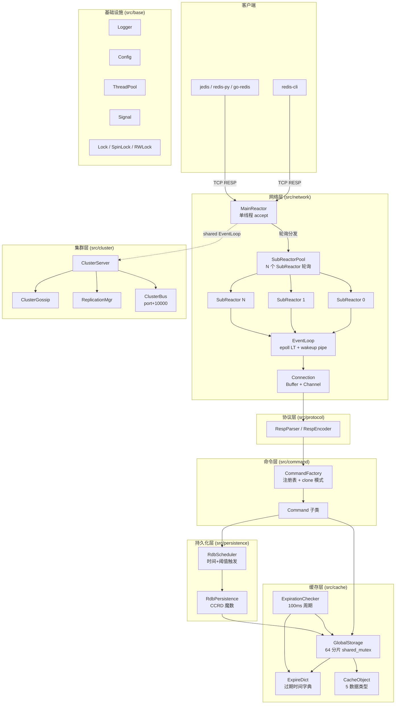
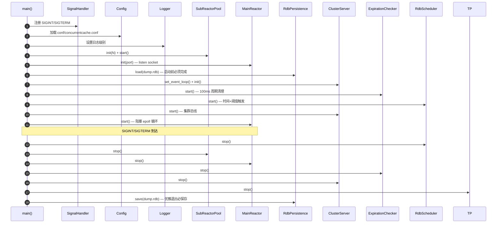
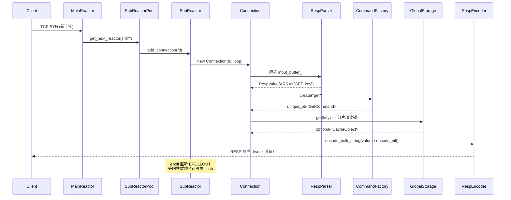

# 架构总览

> **范围**：ConcurrentCache V3.0+ 系统分层、组件依赖、请求处理时序。
> **适用读者**：所有工程师。
> **前置阅读**：[项目 README](../../README.md)。
> **深入阅读**：[网络层](./network.md) · [存储层](./storage.md) · [内存池](./memory-pool.md) · [持久化](./persistence.md) · [集群](./cluster.md)。

## 1. 设计目标

| 目标 | 指标 | 落地手段 |
|------|------|---------|
| 高并发 | QPS ≥ 10 万（混合负载，8 核） | MainSubReactor 多线程 + 64 分片分段锁 + 无锁 ThreadCache |
| 低延迟 | GET P99 ≤ 1ms | 线程本地分配、惰性过期、epoll LT 模式 |
| 数据安全 | 重启不丢数据 | RDB 周期快照 + 优雅退出强制保存 |
| 横向扩展 | 多节点分片 | 16384 哈希槽 + Gossip + 主从复制 |
| 协议兼容 | Redis 客户端直连 | RESP 2.0 解析/编码 |

## 2. 系统分层

## 3. 模块清单

| 层 | 模块 | 关键类 | 职责 |
|----|------|--------|------|
| 入口 | `main.cpp` | `main()` | 信号注册 → 加载配置 → 启动组件 → 阻塞 `MainReactor` |
| 网络 | `src/network/` | `MainReactor`、`SubReactorPool`、`EventLoop`、`Connection`、`Channel`、`Buffer` | 端口监听、连接分发、I/O 多路复用、读写缓冲 |
| 协议 | `src/protocol/` | `RespParser`、`RespEncoder`、`RespValue` | RESP 2.0 解析/编码，`std::variant` 统一表示 |
| 命令 | `src/command/` | `Command` 基类、`CommandFactory` 单例 | 命令注册、参数校验、调用存储层、生成 RESP 响应 |
| 存储 | `src/cache/` | `GlobalStorage`、`CacheObject`、`ExpireDict`、`ExpirationChecker` | 64 分片哈希表、5 数据类型、过期管理 |
| 内存池 | `src/memorypool/` | `MemoryPool`、`SizeClass`、`ThreadCache`、`CentralCache`、`PageCache`、`Span`、`FreeList` | 8B ~ 256KB 三级池化；>256KB 直 malloc |
| 持久化 | `src/persistence/` | `RdbPersistence` 单例、`RdbScheduler` | RDB 写入/读取、自动保存调度 |
| 集群 | `src/cluster/` | `ClusterServer`、`ClusterState`、`ClusterNode`、`ClusterBus`、`ClusterGossip`、`ReplicationMgr` | 槽位管理、Gossip、主从复制、客观下线、故障转移 |
| 基础设施 | `src/base/` | `Logger`、`Config`、`ThreadPool`、`Signal`、`lock.cpp` | 跨层通用组件 |

## 4. 启动流程

`main.cpp` 严格按照以下顺序初始化（顺序不可乱）：

**关键不变量**：

1. `GlobalStorage::instance()` 必须在 `RdbPersistence::load()` 之前可用（`RdbPersistence::load` 直接写入存储）
2. `MainReactor::event_loop()` 必须在 `ClusterServer::set_event_loop()` 之前构造完成
3. `SubReactorPool` 必须先于 `MainReactor` 启动（`MainReactor` 接受新连接后要分发到 `SubReactor`）
4. RDB 加载必须在 `ExpirationChecker` 启动前完成（避免并发修改）

## 5. 请求处理时序

以 `GET key` 为例，追踪一个请求在系统内的完整路径：

**关键路径时长估算**（Release 构建、8 核、64 分片、混合负载）：

| 阶段 | 耗时 |
|------|------|
| TCP accept + 分发 | < 10 μs |
| RESP 解析（短命令） | < 5 μs |
| `CommandFactory::create`（map 查找 + clone） | < 1 μs |
| `GlobalStorage::get`（分片读锁 + hash 查找） | < 1 μs |
| RESP 编码 | < 5 μs |
| 写 socket（LT 模式，epoll 触发） | < 10 μs |
| **合计** | **< 50 μs** |

## 6. 关键不变量

| 不变量 | 维护机制 |
|--------|---------|
| `GlobalStorage` 全局唯一 | Magic Static 单例 + `delete` 拷贝构造 |
| 每分片独立加锁 | `std::unique_ptr<std::shared_mutex[]>` + 哈希分片 |
| `Connection` 生命周期 ≤ `EventLoop` | `SubReactor` 持有 `unique_ptr<Connection>` |
| `Command` 实例独立 | `CommandFactory` 存储模板 + `clone()` 创建新实例 |
| 过期键最终被删除 | 惰性删除（get 时）+ 周期删除（100ms 抽 20 个）双重保证 |
| 写入 RDB 前不丢数据 | 周期快照 + 优雅退出强制保存 + 启动时 `load()` |
| 信号处理不阻塞 | `signal_handler` 仅做 atomic store + `write(STDERR_FILENO)`（async-signal-safe） |
| `MainReactor` 退出 | SIGINT/SIGTERM → `atomic<bool>::exchange(false)` → `EventLoop::quit()` → `wakeup()` 唤醒 epoll |

## 7. 性能特征

| 指标 | 目标 | 实测参考 |
|------|------|---------|
| GET QPS（单实例） | ≥ 20 万 | 见 `docs/benchmark_dashboard.png` |
| SET QPS | ≥ 15 万 | 同上 |
| 混合 7:2:1 P99 | ≤ 5ms | 同上 |
| 10000 并发连接 | 服务稳定 | `e2e_connection_storm.py` |

## 8. 部署形态

| 形态 | 组件裁剪 | 启动配置 |
|------|---------|---------|
| **单实例** | 全部模块，`cluster_enabled=false` | 默认配置即可 |
| **集群** | `ClusterServer` 启用 Gossip + Bus + Replication | `cluster_enabled=true` + `cluster_node_timeout` |

详细配置见 [`deployment.md` § 4](../deployment.md)。

## 9. 另见

- [网络层详解](./network.md)
- [存储层详解](./storage.md)
- [内存池详解](./memory-pool.md)
- [持久化详解](./persistence.md)
- [集群详解](./cluster.md)
- [API 命令手册](../api.md)
