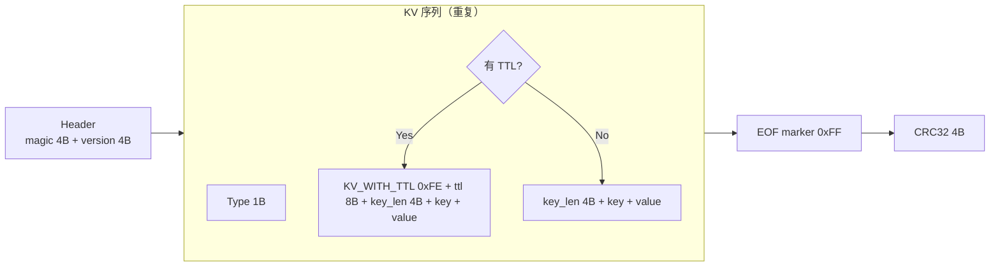
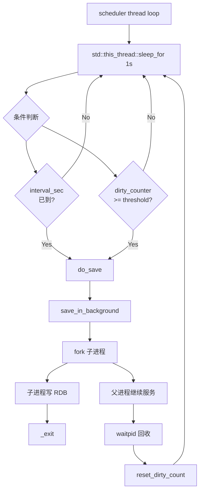
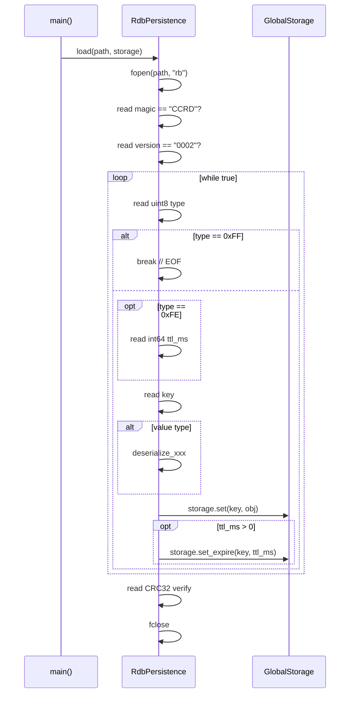

# 持久化架构

> **范围**：RDB 快照格式、5 类型序列化/反序列化、RdbScheduler 自动保存、优雅退出保存。
> **源码**：`src/persistence/`
> **前置阅读**：[架构总览](./overview.md) · [存储层](./storage.md)

## 1. 设计目标

| 目标 | 手段 |
|------|------|
| 服务重启不丢数据 | RDB 周期快照 + 启动 `load()` 恢复 |
| 不阻塞主线程 | 后台线程 `RdbScheduler` + 进程级 fork (`BGSAVE`) |
| 5 数据类型全支持 | STRING/LIST/HASH/SET/ZSET 各自独立序列化方法 |
| 写后容灾 | TTL 信息随快照持久化 |
| 优雅退出不丢最后写 | `main.cpp` 退出路径强制 `save()` |

## 2. RDB 文件格式

### 2.1 魔数与版本

```cpp
constexpr uint32_t kRdbMagic   = 0x43435244;  // "CCRD"  (大端)
constexpr uint8_t  kRdbVersion[4] = {'0','0','0','2'};
```

### 2.2 帧结构



### 2.3 类型字节（`RdbValueType`）

| 值 | 含义 | 底层序列化 |
|----|------|-----------|
| `0x00` | STRING | `string_len(4B) + bytes` |
| `0x01` | LIST | `count(4B) + count × (len + bytes)` |
| `0x02` | HASH | `count(4B) + count × (key_len + key + val_len + val)` |
| `0x03` | SET | `count(4B) + count × (len + bytes)` |
| `0x04` | ZSET | `count(4B) + count × (member_len + member + score_double)` |
| `0xFE` | KV_WITH_TTL（前置 marker） | `ttl_ms(8B)` |
| `0xFF` | EOF_MARKER | 文件结束 |

## 3. 核心类

### 3.1 `RdbPersistence`（`src/persistence/rdb.{h,cpp}`）

| 成员 | 类型 | 说明 |
|------|------|------|
| `static RdbPersistence& instance()` | Magic Static | 全局单例 |
| `file_` | `FILE*` | 当前打开的 RDB 文件 |
| `filepath_` | `string` | RDB 路径（`rdb_path` 配置） |
| `bgsave_in_progress_` | `atomic<int>` | BGSAVE 是否正在进行 |
| `stats_` | `RdbStats` | 统计信息（原子字段） |
| `save(filepath, storage)` | `bool` | 同步保存（阻塞） |
| `save_in_background(filepath, storage)` | `bool` | 异步保存（fork） |
| `load(filepath, storage)` | `bool` | 启动时加载 |
| `wait_for_bgsave(timeout_ms)` | `bool` | 等待 BGSAVE 完成 |

**`RdbStats`**：

```cpp
struct RdbStats {
    std::atomic<int64_t>    last_bgsave_time_sec{0};
    std::atomic<BgsaveStatus> last_bgsave_status{BgsaveStatus::IDLE};
    std::atomic<size_t>     last_bgsave_keys{0};
    std::atomic<size_t>     total_bgsave_calls{0};
    std::atomic<size_t>     total_rdb_saved_keys{0};
};
```

### 3.2 `RdbScheduler`（`src/persistence/rdb_scheduler.{h,cpp}`）

| 成员 | 类型 | 说明 |
|------|------|------|
| `storage_` | `GlobalStorage&` | 被持久化的对象 |
| `rdb_path_` | `string` | 目标路径 |
| `config_` | `SaveConfig` | 调度策略 |
| `scheduler_thread_` | `thread` | 后台调度线程 |
| `running_` | `atomic<bool>` | 运行标志 |

**`SaveConfig`**：

```cpp
struct SaveConfig {
    int interval_sec    = 900;   // 默认 15 分钟
    int dirty_threshold = 1;     // 默认 1 个脏键就触发
};
```

> 实际取值由 `conf/concurrentcache.conf` 的 `rdb_save_interval` / `rdb_dirty_threshold` 覆盖。

## 4. 调度策略



**do_save 流程**（`rdb_scheduler.cpp::do_save()`）：

```text
1. if rdb.is_bgsave_in_progress(): return   // 防并发
2. rdb.save_in_background(rdb_path, storage)  // fork + 写文件
3. waitpid 非阻塞检查，更新 stats
4. storage.reset_dirty_count()               // 重置脏计数
```

## 5. 同步保存 vs 异步保存

| 维度 | `save` (同步) | `save_in_background` (异步) |
|------|---------------|---------------------------|
| 调用方 | `SAVE` 命令、优雅退出 | `BGSAVE` 命令、`RdbScheduler` |
| 阻塞主线程 | **是** | 否（后台线程） |
| 内存峰值 | 高（需要快照整库） | 高（需额外拷贝或 COW） |
| 失败处理 | 返回错误给客户端 | 更新 `last_bgsave_status` |
| 实现 | `RdbPersistence::save` | 内部调用 `save`，在后台线程执行 |

> **注意**：当前 `save_in_background` 内部直接调用 `save`（同步写），未使用 `fork()` 实现写时复制隔离。大量写操作期间 BGSAVE 可能与写请求竞争锁，未来可扩展 fork 模式实现真正的无锁快照。

## 6. 5 数据类型序列化

### 6.1 STRING

```cpp
void RdbPersistence::write_kv_pair(key, CacheObject obj, expire_ms) {
    write_uint8(RdbValueType::STRING);   // 0x00
    write_uint32(key.size()); write_string(key);
    write_uint32(obj.get_string()->size());
    write_string(obj.get_string().value());
}
```

### 6.2 LIST

```cpp
void serialize_list(const CacheObject& obj) {
    write_uint8(LIST);                    // 0x01
    auto& list = obj.list_val_;
    write_uint32(list.size());
    for (auto& item : list) {
        write_uint32(item.size());
        write_string(item);
    }
}
```

### 6.3 HASH

```cpp
void serialize_hash(const CacheObject& obj) {
    write_uint8(HASH);                    // 0x02
    write_uint32(obj.hash_val_.size());
    for (auto& [k, v] : obj.hash_val_) {
        write_uint32(k.size()); write_string(k);
        write_uint32(v.size()); write_string(v);
    }
}
```

### 6.4 SET

```cpp
void serialize_set(const CacheObject& obj) {
    write_uint8(SET);                     // 0x03
    write_uint32(obj.set_val_.size());
    for (auto& m : obj.set_val_) {
        write_uint32(m.size()); write_string(m);
    }
}
```

### 6.5 ZSET

```cpp
void serialize_zset(const CacheObject& obj) {
    write_uint8(ZSET);                    // 0x04
    write_uint32(obj.zset_val_.size());
    for (auto& m : obj.zset_val_) {       // 已有序
        write_uint32(m.member.size()); write_string(m.member);
        write_double(m.score);
    }
}
```

**反序列化**：每个类型对应一个 `deserialize_xxx(CacheObject&)` 方法，按相同顺序读回。

## 7. 加载流程

`main.cpp` 在 `SubReactorPool.start()` 之后、`ExpirationChecker.start()` 之前调用 `RdbPersistence::load(rdb_path, storage)`。



**关键不变量**：

- 加载过程中不启动 `ExpirationChecker`（避免并发修改 `GlobalStorage`）
- 加载顺序与持久化时一致（保证 ZSet 等有序结构正确）
- 加载失败不致命（打印警告，从空存储启动）

## 8. 关键不变量

| 不变量 | 维护机制 |
|--------|---------|
| 单实例 | Magic Static + `delete` 拷贝 |
| BGSAVE 不并发 | `bgsave_in_progress_` 原子标志 |
| 写后脏计数递增 | 命令层 `set/del/expire` 调用 `storage.increment_dirty()` |
| 启动前已恢复 | `load()` 在 `SubReactor.start()` 之后、`ExpirationChecker.start()` 之前 |
| 优雅退出保存 | `main.cpp` 关闭流程最后 `rdb.save(path, storage)` |
| 5 类型全支持 | `RdbValueType` 枚举 + 各自序列化方法 |
| TTL 持久化 | `KV_WITH_TTL` marker + 8 字节毫秒时间戳 |
| 序列化顺序 = 反序列化顺序 | 严格 `for-each` 写入 / `for-each` 读取 |

## 9. 性能与调优

| 现象 | 调优点 |
|------|-------|
| RDB 文件过大 | 调小 `rdb_save_interval` 更频繁落盘 |
| 启动加载慢 | 减少 `max_entries` 或分批 `set` |
| 写后磁盘压力大 | 调高 `rdb_dirty_threshold` |
| BGSAVE 内存峰值 | 限制单实例 `max_entries` ≤ 1M |
| 加载后数据错乱 | 检查文件 magic / CRC |

## 10. 关键源码位置

| 关注点 | 文件 |
|--------|------|
| 同步 save | `src/persistence/rdb.cpp`（`RdbPersistence::save`） |
| 异步 save | `src/persistence/rdb.cpp`（`save_in_background`） |
| 加载 | `src/persistence/rdb.cpp`（`RdbPersistence::load`） |
| 调度循环 | `src/persistence/rdb_scheduler.cpp`（`schedule_loop/do_save`） |
| 5 类型序列化 | `src/persistence/rdb.cpp`（`serialize_string/list/hash/set/zset`） |

## 11. 另见

- [存储层 § 6 RDB 集成](./storage.md#6-rdb-集成)
- [部署 § 持久化策略](../deployment.md)
- [API § SAVE / BGSAVE](../api.md)
