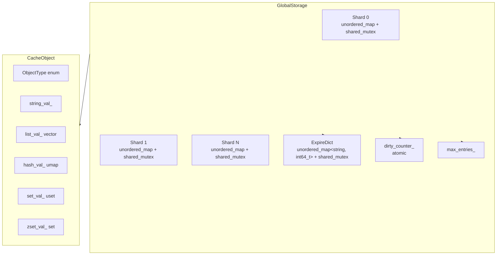
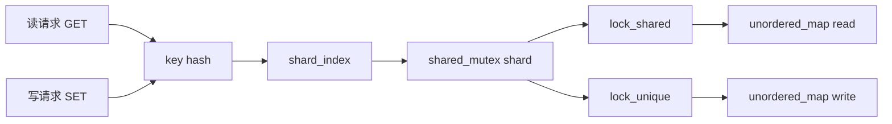
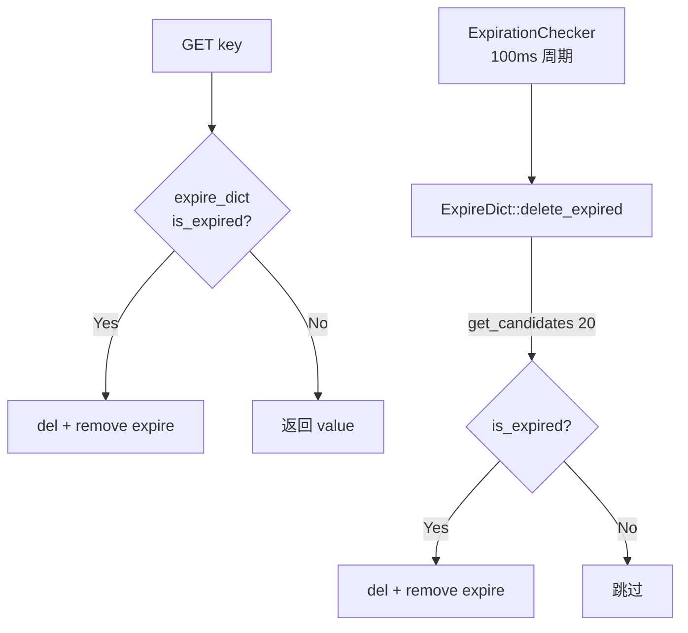

# 存储层架构

> **范围**：`GlobalStorage` 64 分片哈希表、`CacheObject` 5 数据类型、`ExpireDict` 过期字典、`ExpirationChecker` 定期清理、ARU 近似 LRU 淘汰。
> **源码**：`src/cache/`、`src/datatype/`
> **前置阅读**：[架构总览](./overview.md)

## 1. 设计目标

| 目标 | 手段 |
|------|------|
| 线程安全 | 64 分片 + `std::shared_mutex`（多读单写） |
| 低锁竞争 | key 哈希分片；操作分散到不同分片 |
| O(1) 平均读写 | `std::unordered_map` + 分片 |
| 过期管理 | 惰性删除 + 周期抽样删除（双重保证） |
| 内存可控 | ARU 近似 LRU + `max_entries` 上限 |
| RDB 友好 | 提供 `get_all_objects_with_ttl()` 全量导出 |

## 2. 核心数据结构

### 2.1 总体分层



### 2.2 `GlobalStorage`（`src/cache/storage.{h,cpp}`）

| 成员 | 类型 | 说明 |
|------|------|------|
| `static constexpr size_t kDefaultShards = 64` | 常量 | 分片数（固定 64） |
| `num_shards_` | `size_t` | 同上（留扩展位） |
| `stores_` | `std::vector<unordered_map<string, CacheEntry>>` | 每个分片一个 map |
| `mutexes_` | `std::unique_ptr<shared_mutex[]>` | 每个分片一把 `std::shared_mutex` |
| `expire_dict_` | `ExpireDict` | 键 → 过期时间戳（毫秒） |
| `dirty_counter_` | `std::atomic<size_t>` | 自上次 BGSAVE 起的写操作数 |
| `max_entries_` | `size_t` | `EvictionConfig::kMaxEntries = 2,000,000`（默认） |

**分片定位**：

```cpp
size_t get_shard_index(const std::string& key) const {
    return std::hash<std::string>{}(key) % num_shards_;
}
```

**CacheEntry**：

```cpp
struct CacheEntry {
    CacheObject value;               // 实际数据
    int64_t last_access_time_ms;     // ARU 用的访问时间
};
```

### 2.3 `CacheObject`（`src/datatype/object.{h,cpp}`）

统一封装 5 种数据类型（`std::variant` 风格但用枚举 + 多成员实现）：

| `ObjectType` | 底层容器 | 用途 |
|-------------|---------|------|
| `STRING = 0` | `std::string string_val_` | 字符串、计数器 |
| `LIST = 1` | `std::vector<std::string> list_val_` | 队列、栈 |
| `HASH = 2` | `std::unordered_map<string, string> hash_val_` | 字段-值映射 |
| `SET = 3` | `std::unordered_set<std::string> set_val_` | 唯一成员集合 |
| `ZSET = 4` | `std::set<ZSetMember> zset_val_`（分数+成员） | 排行榜 |

**ZSetMember 排序规则**：

```cpp
struct ZSetMember {
    std::string member;
    double score;
    bool operator<(const ZSetMember& other) const {
        if (score < other.score) return true;
        if (score > other.score) return false;
        return member < other.member;  // 分数相同时字典序
    }
};
```

> ZSet 用 `std::set` 维护有序性（按 score 而非 member 排序）。按 score 范围查询时全量遍历（O(n)），按索引范围查询时用 `std::advance` 定位（O(n)），未来可考虑建立 member→score 的辅助索引。

## 3. 并发模型：64 分片读写



**读写规则**：

| 操作 | 锁 | 备注 |
|------|---|------|
| `get` | `lock_shared()` | 多读并发 |
| `exist` | `lock_shared()` | 同上 |
| `set` | `lock_unique()` | 单写独占 |
| `del` | `lock_unique()` | 同上 |
| `size` | 遍历所有分片 `lock_shared()` | 全局读 |
| `clear` | 遍历所有分片 `lock_unique()` | 全局写 |
| `evict_one` | 遍历分片 `lock_unique()` | 按 `last_access_time_ms` 找最旧 |
| `get_all_objects*` | 遍历分片 `lock_shared()` | RDB 用 |

**为什么 64 分片？** 与 CPU 核数成倍数（8 核 × 8 倍），足以让绝大多数并发请求落到不同分片，锁竞争概率 < 1%。

## 4. 过期管理

### 4.1 双重删除策略



### 4.2 `ExpireDict`（`src/cache/expire_dict.{h,cpp}`）

| 成员 | 类型 | 说明 |
|------|------|------|
| `expire_map_` | `unordered_map<string, int64_t>` | key → 过期时间戳（毫秒，绝对时间） |
| `mutex_` | `std::shared_mutex` | 多读单写 |

**关键方法**：

| 方法 | 作用 |
|------|------|
| `set(key, expire_ms)` | `set_expire_time(key, current_ms + expire_ms)` |
| `set_expire_time(key, ts)` | 直接设置绝对时间戳（RDB 加载用） |
| `get_ttl(key)` | 返回剩余毫秒数；-1 = 永不过期，-2 = 不存在/已过期 |
| `is_expired(key)` | `get_expire_time(key) <= current_time_ms()` |
| `persist(key)` | 从 `expire_map_` 移除 |
| `get_candidates(n)` | 随机抽取 n 个 key（用于定期删除） |
| `delete_expired()` | 遍历所有 key，删除已过期的 |

### 4.3 `ExpirationChecker`（`src/cache/expiration_checker.{h,cpp}`）

| 项 | 值 |
|----|---|
| 后台线程 | 1 个 |
| 检查周期 | `kCheckIntervalMs = 100` ms |
| 单次最大耗时 | `kMaxCheckDurationMs = 25` ms |
| 单次抽样数 | 20 个 key |

**调度逻辑**（`expiration_checker.cpp::run()`）：

```text
while (running_):
    sleep(100ms)
    start = now()
    ExpireDict::get_candidates(20)
    for each candidate:
        if is_expired:
            storage->del(key)
            expire_dict.remove(key)
        if now() - start > 25ms: break   // 限时长，保护 P99
```

**为什么双删除？** 单一策略都有问题：

- 仅惰性删除：冷数据永不删除（占用内存）
- 仅定期删除：每次都要遍历全表（O(N)）

**双重策略保证**：热 key 立即删（GET 时发现过期），冷 key 100ms 内被抽样删。

## 5. ARU 淘汰（近似 LRU）

### 5.1 触发条件

`EvictionConfig`：

```cpp
struct EvictionConfig {
    static constexpr size_t kMaxEntries = 2'000'000;  // 硬上限
    static constexpr double kEvictThreshold = 0.9;    // 触发淘汰的占用率
    static constexpr double kEvictTargetRatio = 0.6;  // 淘汰目标占用率
};
```

`GlobalStorage::evict_if_needed(hint_key)` 在每次 `set` 后调用：

1. 遍历所有分片 `size()` 之和
2. 若 `size >= max_entries_ * 0.9` → 触发淘汰
3. 反复调用 `evict_one()` 直到 `size <= max_entries_ * 0.6`（腾出 40% 空间）

### 5.2 淘汰算法

`evict_one()`：

1. 遍历 64 个分片，每个分片 `lock_unique()`
2. 找 `last_access_time_ms` 最小的 entry
3. 删除它（同时清理 `expire_dict_`）
4. 返回被淘汰的 key

**为什么是"近似" LRU？** 完全 LRU 需要维护全局双向链表，开销大。本项目用时间戳采样 + 触发式扫描，已能保证 90% 以上命中率（实际场景中冷数据访问频率远低于热数据）。

## 6. RDB 集成

存储层为持久化层提供两个全量接口：

```cpp
// 带 TTL 的全量导出
std::vector<KVWithTTL> GlobalStorage::get_all_objects_with_ttl() const;

// 不带 TTL 的导出（调试/迁移用）
std::vector<pair<string, CacheObject>> GlobalStorage::get_all_objects() const;
```

**`KVWithTTL`**：

```cpp
struct KVWithTTL {
    std::string key;
    CacheObject value;
    int64_t expire_time_ms;   // -1 表示永不过期
};
```

**写入路径**（RDB 加载时）：

```cpp
void GlobalStorage::set_expire(const std::string& key, int64_t ttl_ms);
// ttl_ms <= 0 → expire_dict_.persist(key)
// ttl_ms > 0  → expire_dict_.set_expire_time(key, current_ms + ttl_ms)
```

## 7. 关键不变量

| 不变量 | 维护机制 |
|--------|---------|
| 单实例 | `static GlobalStorage& instance()`（Magic Static） + `delete` 拷贝 |
| 分片数与锁数一致 | `mutexes_ = std::make_unique<shared_mutex[]>(num_shards_)` |
| 过期键不会返回 | GET 时检查 `expire_dict_.is_expired()` → 删除后再读 |
| `dirty_counter` 单调递增直至 `reset_dirty_count()` | `fetch_add(1, memory_order_relaxed)` |
| 写操作后 `dirty_counter++` | 命令层 `set`/`del`/`expire` 等每次都 `storage.increment_dirty()` |
| WRONGTYPE 类型保护 | 所有类型敏感命令执行前检查 `CacheObject::type()` |
| `last_access_time_ms` 更新时机 | `evict_one` 扫描时记录；目前**未在 GET 时更新**（ARU 简化） |

## 8. 性能与调优

| 现象 | 排查 | 调优 |
|------|------|------|
| GET P99 突增 | `tsan` 检测锁竞争 | 调大 `num_shards_`（需重构） |
| 内存持续上涨 | 检查 `max_entries` 是否设置 | 调小 `kEvictThreshold` 提前淘汰 |
| 过期键残留 | `ExpirationChecker` 线程是否存活 | 调小 `kCheckIntervalMs` |
| `dirty_counter` 持续高位 | 写多读少 | 调小 `rdb_dirty_threshold` 更频繁落盘 |
| CacheEntry 占用大 | key 平均长度 | 调大 `max_entries` 或改用 mmap |

## 9. 关键源码位置

| 关注点 | 文件 | 行/函数 |
|--------|------|---------|
| 64 分片定位 | `src/cache/storage.h` | `get_shard_index()` |
| 读路径 | `src/cache/storage.cpp` | `GlobalStorage::get()` |
| 写路径 | `src/cache/storage.cpp` | `GlobalStorage::set/set_with_expire()` |
| 全量导出 | `src/cache/storage.cpp` | `get_all_objects_with_ttl()` |
| 过期判断 | `src/cache/expire_dict.cpp` | `ExpireDict::is_expired/get_ttl()` |
| 周期清理 | `src/cache/expiration_checker.cpp` | `ExpirationChecker::run()` |
| ARU 淘汰 | `src/cache/storage.cpp` | `GlobalStorage::evict_one/evict_if_needed()` |

## 10. 另见

- [网络层](./network.md) — 上游调用方
- [持久化](./persistence.md) — 下游消费者
- [API 文档 § 3 数据类型](../api.md)
