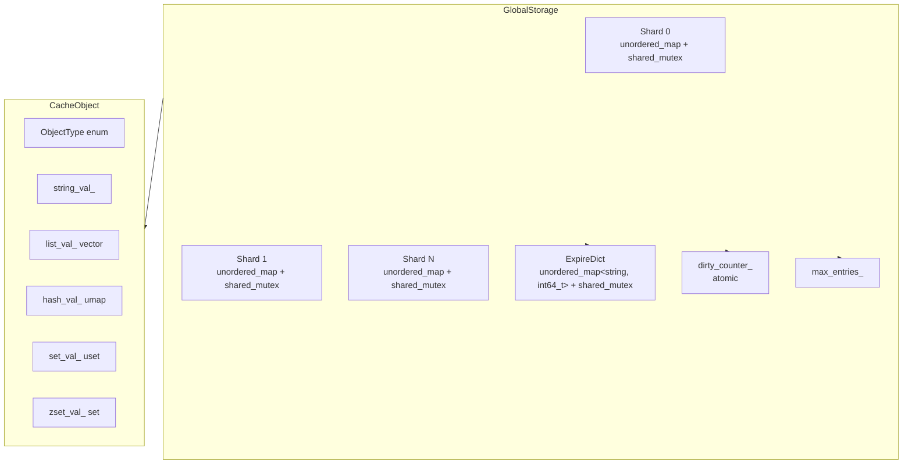
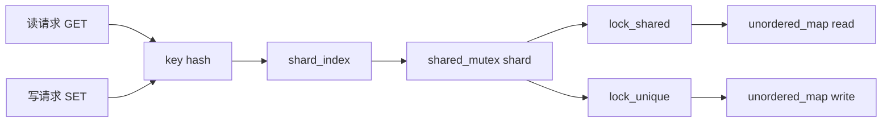
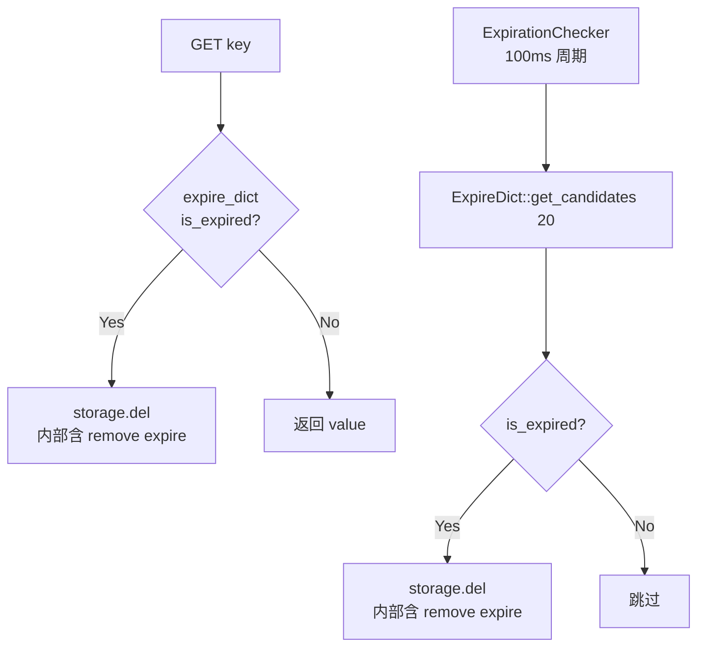

# 存储层架构

> **范围**：`GlobalStorage` 64 分片哈希表、`CacheObject` 5 数据类型、`ExpireDict` 过期字典、`ExpirationChecker` 定期清理、ARU 近似 LRU 淘汰。
> **源码**：`src/cache/`、`src/datatype/`
> **前置阅读**：[架构总览](./overview.md)

## 1. 设计目标

| 目标 | 手段 |
|------|------|
| 线程安全 | 64 分片 + `std::shared_mutex`（多读单写） |
| 低锁竞争 | key 哈希分片；操作分散到不同分片 |
| O(1) 平均读写 | `std::unordered_map` + 分片 |
| 过期管理 | 惰性删除 + 周期抽样删除（双重保证） |
| 内存可控 | ARU 近似 LRU + `max_entries` 上限 |
| RDB 友好 | 提供 `get_all_objects_with_ttl()` 全量导出 |

## 2. 核心数据结构

### 2.1 总体分层


```mermaid
flowchart TB
    subgraph GS[GlobalStorage]
        S0[Shard 0<br/>unordered_map + shared_mutex]
        S1[Shard 1<br/>unordered_map + shared_mutex]
        SN[Shard N<br/>unordered_map + shared_mutex]
        ED[ExpireDict<br/>unordered_map&lt;string, int64_t&gt; + shared_mutex]
        DC[dirty_counter_<br/>atomic]
        ME[max_entries_]
    end

    subgraph CO[CacheObject]
        T[ObjectType enum]
        SV[string_val_]
        LV[list_val_ vector]
        HV[hash_val_ umap]
        STV[set_val_ uset]
        ZV[zset_val_ set]
    end

    GS --> CO
    GS --> ED
    GS --> DC
    GS --> ME
```

### 2.2 `GlobalStorage`（`src/cache/storage.{h,cpp}`）

| 成员 | 类型 | 说明 |
|------|------|------|
| `static constexpr size_t kDefaultShards = 64` | 常量 | 分片数（固定 64） |
| `num_shards_` | `size_t` | 同上（留扩展位） |
| `stores_` | `std::vector<unordered_map<string, CacheEntry>>` | 每个分片一个 map |
| `mutexes_` | `std::unique_ptr<shared_mutex[]>` | 每个分片一把 `std::shared_mutex` |
| `expire_dict_` | `ExpireDict` | 键 → 过期时间戳（毫秒） |
| `dirty_counter_` | `std::atomic<size_t>` | 自上次 BGSAVE **启动成功**起的写操作数；`set`/`set_conditional`/`del`/`set_with_expire`/`incrby` 及各容器写路径（统一走 `mutate`）递增，EXPIRE/PEXPIRE/EXPIREAT/PERSIST 这些只改 TTL 的命令在 `expire_cmd.h` 里显式 `increment_dirty()`；惰性删除调的就是 `del()`（`storage.cpp:52-56` → `:189`），所以过期键被被动清理时**同样**递增脏计数 |
| `max_entries_` | `size_t` | 淘汰触发线；默认 `EvictionConfig::kMaxEntries = 2,000,000`，`main.cpp` 启动时读 conf 的 `max_entries`（缺省 0 表示不改）并调 `set_max_entries()` 覆盖 |

**分片定位**：

```cpp
size_t get_shard_index(const std::string& key) const {
    return std::hash<std::string>{}(key) % num_shards_;
}
```

**CacheEntry**：

```cpp
struct CacheEntry {
    CacheObject value;                        // 实际数据
    std::atomic<int64_t> last_access_time_ms; // ARU 用的访问时间（原子：GET 共享锁下更新）
    // 成员只剩 value 与 last_access_time_ms 两个。这里曾经另存过一个
    // int64_t expire_at_ms（绝对过期时间戳，-1 = 永不过期），读路径于是双判
    // （expire_dict_.is_expired(key) || entry.expire_at_ms）：PERSIST 只清得掉字典、
    // 清不掉条目那一份，SETEX+PERSIST 组合下 GET 仍把键当过期删掉。冗余副本确认无读者
    // 之后整个删了，过期时间的唯一真相源是 ExpireDict（storage.h:17-22）。
};
```

### 2.3 `CacheObject`（`src/datatype/object.{h,cpp}`）

统一封装 5 种数据类型（`std::variant` 风格但用枚举 + 多成员实现）：

| `ObjectType` | 底层容器 | 用途 |
|-------------|---------|------|
| `STRING = 0` | `std::string string_val_` | 字符串、计数器 |
| `LIST = 1` | `std::vector<std::string> list_val_` | 队列、栈 |
| `HASH = 2` | `std::unordered_map<string, string> hash_val_` | 字段-值映射 |
| `SET = 3` | `std::unordered_set<std::string> set_val_` | 唯一成员集合 |
| `ZSET = 4` | `std::set<ZSetMember> zset_val_`（分数+成员） | 排行榜 |

**ZSetMember 排序规则**：

```cpp
struct ZSetMember {
    std::string member;
    double score;
    bool operator<(const ZSetMember& other) const {
        if (score < other.score) return true;
        if (score > other.score) return false;
        return member < other.member;  // 分数相同时字典序
    }
};
```

> ZSet 用 `std::set` 维护有序性（按 score 而非 member 排序）。按 score 范围查询时全量遍历（O(n)），按索引范围查询时用 `std::advance` 定位（O(n)），未来可考虑建立 member→score 的辅助索引。

## 3. 并发模型：64 分片读写


```mermaid
flowchart LR
    R[读请求 GET] --> H[key hash]
    W[写请求 SET] --> H
    H --> IDX[shard_index]
    IDX --> SHM[shared_mutex shard]
    SHM --> RLOCK[lock_shared]
    SHM --> WLOCK[lock_unique]
    RLOCK --> MAP[unordered_map read]
    WLOCK --> MAPW[unordered_map write]
```

**读写规则**：

| 操作 | 锁 | 备注 |
|------|---|------|
| `get` | `lock_shared()` | 多读并发 |
| `exist` | `lock_shared()` | 同上 |
| `set` | `lock_unique()` | 单写独占 |
| `del` | `lock_unique()` | 同上 |
| `size` | 遍历所有分片 `lock_shared()` | 全局读 |
| `clear` | 遍历所有分片 `lock_unique()` | 全局写 |
| `evict_one` | 随机采样单分片 `lock_unique()`（最多试 8 个分片） | 片内已过期优先，否则取 `last_access_time_ms` 最小（见 §5.2） |
| `get_all_objects*` | 遍历分片 `lock_shared()` | RDB 用 |

**为什么 64 分片？** 代码注释按「CPU 核心数量 × 2」的倍数思路取值（数值为硬编码 64），意图是让并发请求尽量落到不同分片。"锁竞争概率 < 1%"这种数字仓库里没有测量支撑，别再引用；真实竞争水平要看具体键分布，热键全落在同一个分片时 64 也救不了。

## 4. 过期管理

### 4.1 双重删除策略


```mermaid
flowchart TB
    GET[GET key] --> CK{expire_dict<br/>is_expired?}
    CK -->|Yes| DEL1[storage.del<br/>内部含 remove expire]
    CK -->|No| RTN[返回 value]

    BG[ExpirationChecker<br/>100ms 周期] --> GC[ExpireDict::get_candidates 20]
    GC --> CK2{is_expired?}
    CK2 -->|Yes| DEL2[storage.del<br/>内部含 remove expire]
    CK2 -->|No| SKIP[跳过]
```

> 注：后台路径只调 `get_candidates` + `storage.del`；`ExpireDict::delete_expired()` 目前是无调用方的未接线 API。

### 4.2 `ExpireDict`（`src/cache/expire_dict.{h,cpp}`）

| 成员 | 类型 | 说明 |
|------|------|------|
| `expire_map_` | `unordered_map<string, int64_t>` | key → 过期时间戳（毫秒，绝对时间） |
| `mutex_` | `std::shared_mutex` | 多读单写 |

**关键方法**：

| 方法 | 作用 |
|------|------|
| `set(key, expire_ms)` | `set_expire_time(key, current_ms + expire_ms)` |
| `set_expire_time(key, ts)` | 直接设置绝对时间戳（RDB 加载用） |
| `get_ttl(key)` | 返回剩余毫秒数；**-2 = 不存在或已过期**（本方法不返回 -1，"永不过期" 的 -1 由命令层依据 `contains()` 判定） |
| `is_expired(key)` | **不存在 → false**；存在 → `now >= expire_time` |
| `persist(key)` | 从 `expire_map_` 移除 |
| `get_candidates(n)` | 随机抽样 n 个 key（迭代器随机定位，不拷贝全表；`want*4 >= total` 时退化为顺序遍历） |
| `delete_expired()` | 遍历所有 key 删除已过期的（**当前无调用方**） |

### 4.3 `ExpirationChecker`（`src/cache/expiration_checker.{h,cpp}`）

| 项 | 值 |
|----|---|
| 后台线程 | 1 个 |
| 检查周期 | `kCheckIntervalMs = 100` ms |
| 单次时间预算 | `kMaxCheckDurationMs = 25` ms |
| 单次抽样数 | 20 个 key |

**调度逻辑**（`expiration_checker.cpp::run()`）——25ms 预算内**反复**抽样删除，而非一批：

```text
while (running_):
    start = now()                  // 注意顺序：先干活、后睡觉。
    do:                            // 启动后的第一轮是立刻扫的，不用等一个周期
        candidates = ExpireDict::get_candidates(20)
        if candidates.empty(): break
        for each candidate:
            if is_expired:
                storage->del(key)          // 内部已 remove expire
        elapsed = now() - start
        if elapsed >= 25ms: budget_exhausted = true   // 预算用尽就带着标记退出内层
    while (!budget_exhausted)              // 预算内循环多批（Redis 的 activeExpireCycle）
    // 内层结束（候选耗尽或预算用尽）后才睡满 kCheckIntervalMs = 100ms
```

**为什么双删除？** 单一策略都有问题：

- 仅惰性删除：冷数据永不删除（占用内存）
- 仅定期删除：每次都要遍历全表（O(N)）

**双重策略保证**：热 key 立即删（GET 时发现过期），冷 key 100ms 内被抽样删。

## 5. ARU 淘汰（随机分片采样近似 LRU）

### 5.1 触发条件

`EvictionConfig`：

```cpp
struct EvictionConfig {
    static constexpr size_t kMaxEntries = 2'000'000;  // 硬上限
    static constexpr double kEvictThreshold = 0.9;    // 触发淘汰的占用率
    static constexpr double kEvictTargetRatio = 0.6;  // 淘汰目标占用率
};
```

`GlobalStorage::evict_if_needed(hint_key)` 在每次 `set`/`set_with_expire`/`incrby` 前调用：

1. 遍历所有分片求 `size()` 之和
2. 若 `size >= max_entries_ * 0.9` → 触发淘汰
3. 反复调用 `evict_one()` 直到 `size <= max_entries_ * 0.6`（腾出 40% 空间）；
   单轮最多淘汰 1024 个，每 64 个复查一次 `size()`（防并发写入导致过度淘汰）

### 5.2 淘汰算法（随机分片采样）

`evict_one()`：

1. 用线程本地 RNG 随机选一个分片（最多重试 8 个分片）
2. 对该分片 `lock_unique()`
3. 片内扫描：**已过期的 key 优先删除**（等于免费清理）；否则取 `last_access_time_ms` 最小的 entry
4. 当场删除并清理 `expire_dict_`，返回被淘汰的 key

**为什么是采样而不是全局扫描？** 全局最老 key 需要两遍全库扫描（找最老 + 回该分片删除）；在 200 万 key、单轮需淘汰 80 万个的规模下是数十万次全库遍历，且多个写线程并发触发时互相叠加——写入延迟会从微秒级恶化到分钟级。采样版单次代价 O(分片内条目数) ≈ 全库/64，这是 Redis `maxmemory-samples` 的同款思路。

**为什么是"近似" LRU？** 完全 LRU 需要维护全局双向链表，开销大。随机采样分片内最老 key 是对开销与精度的折中（采样数上限见 `evict_one` 的实现）。淘汰命中率本身没有测过，别把它当成保证；能说的是它比严格 LRU 省掉了全局链表的维护成本。

## 6. RDB 集成

存储层为持久化层提供两个全量接口：

```cpp
// 带 TTL 的全量导出
std::vector<KVWithTTL> GlobalStorage::get_all_objects_with_ttl() const;

// 不带 TTL 的导出（调试/迁移用）
std::vector<pair<string, CacheObject>> GlobalStorage::get_all_objects() const;
```

**`KVWithTTL`**：

```cpp
struct KVWithTTL {
    std::string key;
    CacheObject value;
    int64_t expire_time_ms;   // -1 表示永不过期
};
```

**写入路径**（RDB 加载时）：

```cpp
// 原子路径：在分片独占锁内只写 expire_dict_（唯一真相源）
// 条目里不再另存 TTL 副本
storage.set_with_expire(key, obj, 剩余ttl_ms);
// 已过期的 key 加载时直接跳过，不写入
```

> **过期只有一份真相**：`EXPIRE` 命令走 `storage.expire_dict().set()`（`expire_cmd.h:77`），
> 条目里没有第二个 TTL 副本，所以 `evict_one` 的「已过期优先」看的就是 `expire_dict_.get_expire_time()`
> （`storage.cpp:287-291`）——EXPIRE 设置的 key 一样会被优先淘汰，不存在只能按 LRU 兜底的旁路。
> 另外：`GlobalStorage::set_expire()`（`storage.cpp:400`）在 **src 里没有任何调用方**，
> 只有 `test/storage_test/storage_v3_test.cpp:74` 还在用它；命令路径全都直接改 `expire_dict_`。

## 7. 关键不变量

| 不变量 | 维护机制 |
|--------|---------|
| 单实例 | `static GlobalStorage& instance()`（Magic Static） + `delete` 拷贝 |
| 分片数与锁数一致 | `mutexes_ = std::make_unique<shared_mutex[]>(num_shards_)` |
| 过期键不会返回 | GET 时只查 `expire_dict_.is_expired()`（条目里已无 TTL 副本）→ 删除后再读 |
| `dirty_counter` 递增，BGSAVE 启动成功时按观测值 CAS 扣减（`consume_dirty_count()`） | `fetch_add(1, memory_order_relaxed)` |
| 写操作后 `dirty_counter++` | `set`/`del`/`set_with_expire`/`incrby` 内部递增（含 INCR 原子路径） |
| WRONGTYPE 类型保护 | 所有类型敏感命令执行前检查 `CacheObject::type()` |
| 淘汰单次代价有界 | 随机分片采样（O(全库/64)），单轮上限 1024 |
| `last_access_time_ms` 更新时机 | GET 命中时原子更新；淘汰采样时读取 |

## 8. 性能与调优

| 现象 | 排查 | 调优 |
|------|------|------|
| GET P99 突增 | `tsan` 检测锁竞争 | 调大 `num_shards_`（需重构） |
| 内存持续上涨 | 检查 `max_entries_` 触发点是否到达 | `kEvictThreshold`/`kMaxEntries` 为编译期常量，调参需改代码重编 |
| 过期键残留 | `ExpirationChecker` 线程是否存活 | 调小 `kCheckIntervalMs` |
| `dirty_counter` 持续高位 | 写多读少 | 调小 `rdb_dirty_threshold` 更频繁落盘 |
| CacheEntry 占用大 | key 平均长度 | 调大 `max_entries_`（同上，需改代码）或改用 mmap |

## 9. 关键源码位置

| 关注点 | 文件 | 行/函数 |
|--------|------|---------|
| 64 分片定位 | `src/cache/storage.h` | `get_shard_index()` |
| 读路径 | `src/cache/storage.cpp` | `GlobalStorage::get()` |
| 写路径 | `src/cache/storage.cpp` | `GlobalStorage::set/set_with_expire()` |
| 全量导出 | `src/cache/storage.cpp` | `get_all_objects_with_ttl()` |
| 过期判断 | `src/cache/expire_dict.cpp` | `ExpireDict::is_expired/get_ttl()` |
| 周期清理 | `src/cache/expiration_checker.cpp` | `ExpirationChecker::run()` |
| ARU 淘汰 | `src/cache/storage.cpp` | `GlobalStorage::evict_one/evict_if_needed()` |

## 10. 另见

- [网络层](./network.md) — 上游调用方
- [持久化](./persistence.md) — 下游消费者
- [API 文档 § 4 起的各类型命令](../api.md)
